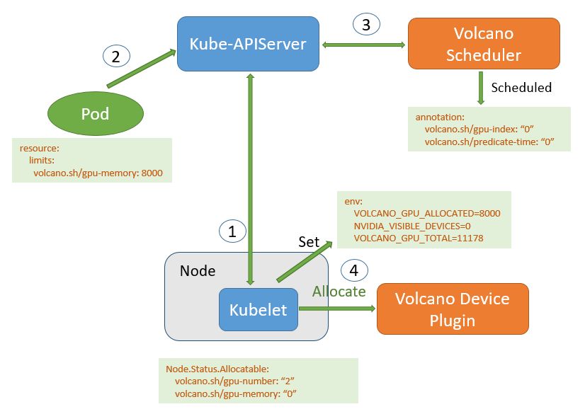

# what is volcano
去官网看就行了

# why 我们选择
k8s目前的schduler是不支持对gpu npu等设备去实现多个任务共享等功能，我们需要对异构设备在k8s的调度能力，并且需要处理批计算。
目前场景有：
保证所有任务同时启动，需要gang 调度
共享GPU异构资源
支持异构设备
等

基本上面我们的场景，我们选择了volcano调度。
Volcano通过Kubernetes提供的Device plugin实现如下功能：
* 收集集群中节点上gpu-number与显存gpu-memory： `volcano.sh/gpu-memory`和`volcano.sh/gpu-number`两种资源
* 监控GPU健康状态
* 在集群中为申请GPU的workload挂载GPU资源

# volcano device plugin
当用户安装部署gpu device plugin 在k8s集群上，我们可以查看get node来看到GPU显存与GPU卡数量信息。
1）GPU device plugin收集并上报GPU资源
 这个是基于https://github.com/NVIDIA/k8s-device-plugin 去支持gpu 的软隔离,这个device 插件是以daemonset 来运行，主要工作有：
 * 暴露每一个node上的gpu数量
 * 跟踪gpu的健康
 * 运行容器gpu enable
 2) 用户提交gpu申请的pod到apiserver
 3) volcano gpu调度插件开启配置：`predicate.GPUSharingEnable: true`
 Predicates插件提供节点的预选功能，在enable GPU sharing功能的情况下会过滤出GPU节点，并选出能够满足当前pod资源申请的GPU卡id。例如：当前集群包含三个节点，其中Node1和Node2每台机器包含2张11178MB显存的GPU卡，Node3不包含GPU卡。当用户创建一个Pod请求80000MB显存资源的时候，调度器首先过滤出包含GPU资源的节点Node1和Node2，然后在节点中选取一张GPU能够满足Pod请求的资源进行调度。在该例子中，Volcano将会为该Pod选取Node2中的GPU1卡进行调度。
 4) 启动容器， 节点上的Kubelet在收到Pod和节点绑定时间后，会创建Pod实体，Kubelet调用GPU plugin中实现的Allocate方法。该方法首先在节点所有pending状态的pod中选取出“volcano.sh/gpu-assigned”为false且predicate时间最早的pod进行创建，并更新该pod的“volcano.sh/gpu-assigned”为true。
大概工作流程如下：

