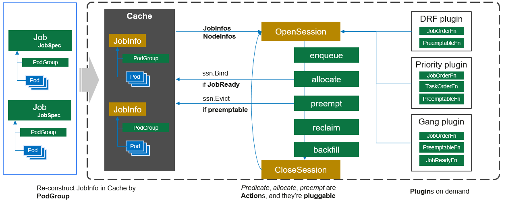
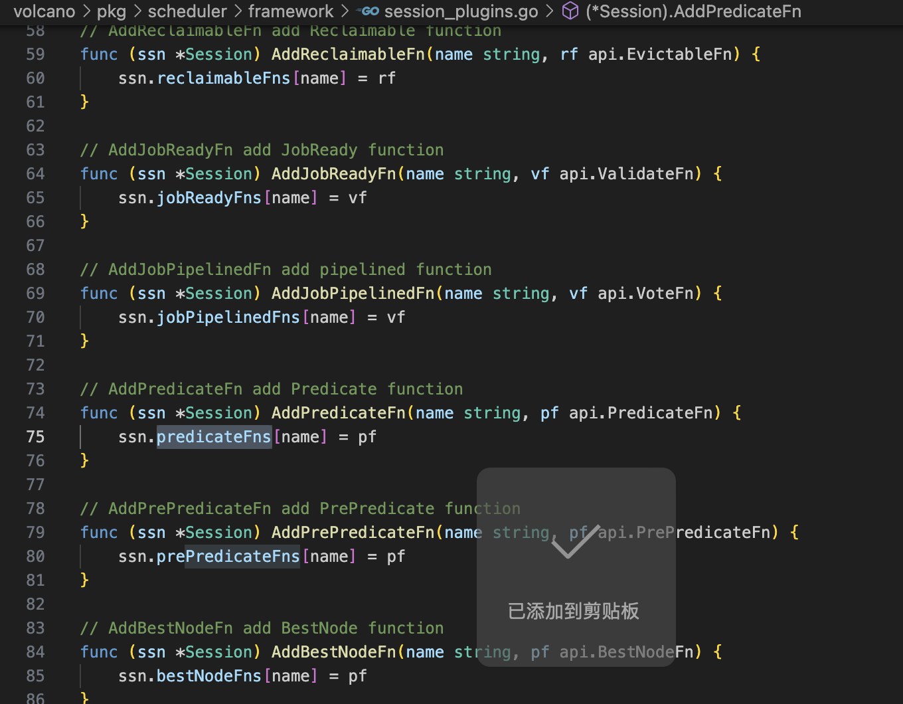
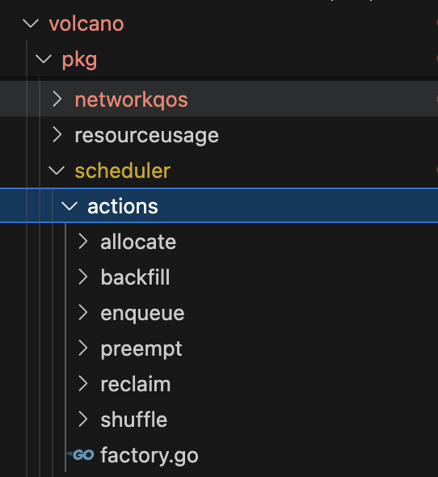
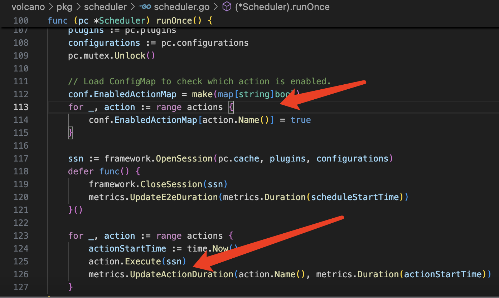

# overview
volcano scheduler是由action和plugin组成，action是指调度每个阶段需要执行的动作，plugin是具体actions中算法的实现


# session
session就是调度周期，默认1秒，每个调度周期都会new一个session 对象
```go
go wait.Until(pc.runOnce, pc.schedulePeriod, stopCh)
```
在`runOnce`里面我们可以看到他会读取配置并且把plugin初始化，然后调用插件的`plugin.OnSessionOpen(ssn)`, 插件在`OnSessionOpen`中初始化所需要的数据，并且将回调函数注册到session中，插件注册的函数常用的有：

* Predict plugin就只注册了`ssn.AddPredicateFn(pp.Name(), func(task *api.TaskInfo, node *api.NodeInfo) error {` 这个AddPredicateFn函数到Session中
* Gang plugin就注册了`ssn.AddJobValidFn(gp.Name(), validJobFn)`  注册了jobvalid 函数
注意Plugin不需要注册下面所有的函数，而是可以根据自己的需要，注册某几个函数。


初始化成功之后，volcano会依次调用不同action的Execute方法

# cache
为什么突然把cache拿出来说很重要就是scheduler启动的顺序，读完配置加载，就到start cache了`pc.cache.Run(stopCh)`，当然这个很多都是使用informer机制了他并没有直接去调用apiserver去操作etcd。
SchedulerCache会持有很多informer， 初始化的informer注册各个eventHandler，然后pod/podgroup等变动会被同步在Jobs, Nodes, Queues, PriorityClasses等几个map中。podgroup加入jobInfo，pod 加入taskInfo，如下所示，我们可以看到他不断同步nodes,
```go
// Run  starts the schedulerCache
func (sc *SchedulerCache) Run(stopCh <-chan struct{}) {
	sc.informerFactory.Start(stopCh)
	sc.vcInformerFactory.Start(stopCh)
	sc.WaitForCacheSync(stopCh)
	for i := 0; i < int(sc.nodeWorkers); i++ {
		go wait.Until(sc.runNodeWorker, 0, stopCh)
	}
	...
}

func (sc *SchedulerCache) SyncNode(nodeName string) error {
	node, err := sc.nodeInformer.Lister().Get(nodeName)
	if err != nil {
    ...
	}

	if !sc.nodeCanAddCache(node) {
		return nil
	}
	nodeCopy := node.DeepCopy()
	csiNode, err := sc.csiNodeInformer.Lister().Get(nodeName)
  ...
	return sc.AddOrUpdateNode(nodeCopy)
}

func (sc *SchedulerCache) nodeCanAddCache(node *v1.Node) bool {
	if !responsibleForNode(node.Name, sc.schedulerPodName, sc.c) {
		return false
	}
	if len(sc.nodeSelectorLabels) == 0 {
		return true
	}
	for labelName, labelValue := range node.Labels {
		key := labelName + ":" + labelValue
		if _, ok := sc.nodeSelectorLabels[key]; ok {
			return true
		}
	}
	klog.Infof("node %s ignore add/update/delete into schedulerCache", node.Name)
	return false
}

```
# actions
以下是vocano的一些action,我没有把所有action 都拿出来讲，只拿



## enqueue


## allocate


## preempt


## backfill

# 插件
插件主要实现了3个函数：Name， OnSessionOpen， OnSessionClose
OnSessionOpen在会话开始时执行一些操作，并注册一些关于调度细节的函数。
OnSessionClose在会话结束时清理一些资源。
下面写一些volcano现在有的插件
首先是怎么配置volcano 调度器使用的插件
```yaml
# default configuration for scheduler
actions: "enqueue, allocate, backfill"
tiers:
- plugins:
  - name: priority
  - name: gang
  - name: conformance
- plugins:
  - name: overcommit
  - name: drf
  - name: predicates
  - name: proportion
  - name: nodeorder
  - name: binpack
```

等上述配置apply 之后，会按以下顺序来启动加载

(OpenSession) --> (enqueue) --> (allocate) --> (backfill) --> (CloseSession)


scheduler首先加载配置文件loadSchedulerConf，从配置文件读取actions以及plugins，这个第一次读取配置文件之后会不断的watch这个配置文件是否有modify/create来update,接下来启动scheduler初始化所需要的informer
定时默认每秒钟去执行每个schduler cycle: `runOnce`
`runOnce`主要是
所有的插件注册都是通过执行`OpenSession` 来被call，

`predicate`插件
`gang`插件