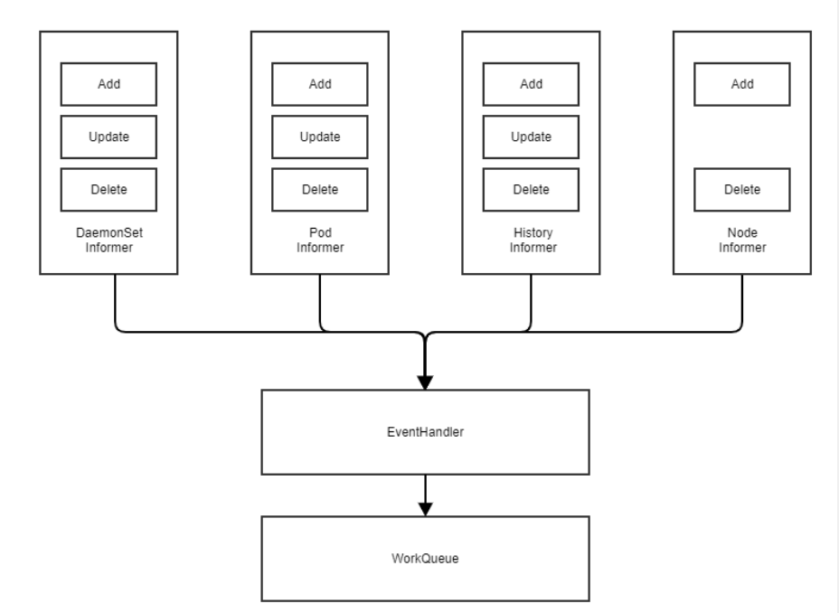
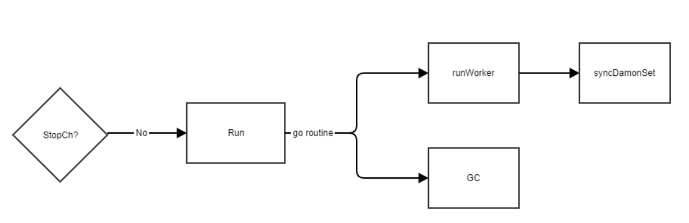

# Overview

这篇文章是基于Kubernetes的master  commitid:  8e8b6a01cf6bf55dea5e2e4f554597a95c82988a写下的源码分析文档。

此篇文档主要是围绕DaemonSet Controller的介绍以及工作原理。

代码位置 `pkg/controller/daemon`

# 概念

DaemonSet 与Deployment或者StatefulSet很不同，DaemonSet是确保全部或者部分节点上运行Pod的一个副本，当有新节点加入集群，会为该节点新增一个Pod，当节点被移除时，Pod也会被回收。因此DaemonSet很适合一些**专注于基础设施的应用场景**例如网络插件或者日志收集。

**DaemonSet的目的是让每个节点或者特定节点都运行一个Pod， 因此认为所有的Pod都不应该跟节点的负载挂钩**，在Kubernetes **早期**的版本， DaemonSet的Pod是不经过调度器调度。因此在早期的版本中，会使用户非常困惑例如会出现调度器未启动之前DaemonSet Controller创建的Pod就可以运行等动作，后期的版本，已经改成默认由调度器调度。

# 实例化DaemonSet Controller

从实例化DaemonSet Controller的代码可以得知该控制器监听了`daemonSetInformer` 、`podInformer`  和`controllerRevision`对象资源的监听的增删改事件，以及`nodeInformer` 的增改事件，使用`EventHandler`将事件写入`workqueue`。



```go
func NewDaemonSetsController(...) (*DaemonSetsController, error) {	
		...		
	daemonSetInformer.Informer().AddEventHandler(cache.ResourceEventHandlerFuncs{
		AddFunc:    dsc.addDaemonset,
		UpdateFunc: dsc.updateDaemonset,
		DeleteFunc: dsc.deleteDaemonset,
	})

	historyInformer.Informer().AddEventHandler(cache.ResourceEventHandlerFuncs{
		AddFunc:    dsc.addHistory,
		UpdateFunc: dsc.updateHistory,
		DeleteFunc: dsc.deleteHistory,
	})

	podInformer.Informer().AddEventHandler(cache.ResourceEventHandlerFuncs{
		AddFunc:    dsc.addPod,
		UpdateFunc: dsc.updatePod,
		DeleteFunc: dsc.deletePod,
	})

	nodeInformer.Informer().AddEventHandler(cache.ResourceEventHandlerFuncs{
		AddFunc:    dsc.addNode,
		UpdateFunc: dsc.updateNode,
	},
	)	

    // 在这里已经将syncDaemonSet方法赋值给syncHandler
	dsc.syncHandler = dsc.syncDaemonSet
	...
	return dsc, nil
}
```

# Run

在DaemonSet Controller Run方法中，主要是运行了两个事件，第一个是执行了`runWorker`来做sync的动作，具体可见`syncDamonSet`章节， 第二个是启动go协程执行`GC，`去做清理Failed的Pods。



```go
func (dsc *DaemonSetsController) Run(workers int, stopCh <-chan struct{}) {
	for i := 0; i < workers; i++ {
		go wait.Until(dsc.runWorker, time.Second, stopCh)
	}
	go wait.Until(dsc.failedPodsBackoff.GC, BackoffGCInterval, stopCh)
	<-stopCh
}
```


## syncDaemonSet

在DaemonSet Controller使用`processNextWorkItem`消费Workqueue的事件的时候，有个最关键的方法，就是`syncDaemonSet`，因此这里特地拿出来详细说明下。

`syncDaemonSet`主要做的事情有：

1. 暴露latency的metrics
2. 判断DaemonSet是否存在
3. 获取所有的节点Node信息
4. 判断DaemonSet的label是否为空，如果是，则直接返回，因为label为空则说明这个DaemonSet是选择了所有的Pod
5. 通过DeletionTimestamp判断DaemonSet是否被删除
6. 获取DaemonSet的current和old `controllerRevision`
7. 查询`expectations`，这个是为了减少不需要的sync
8. 执行`manage`去同步，包括创建需要的Pod, 删除不需要的Pod
9. 清理过期的controllerrevision
10. 最后更新daemonSet的状态

```go
func (dsc *DaemonSetsController) syncDaemonSet(key string) error {
	...
	namespace, name, err := cache.SplitMetaNamespaceKey(key)
	ds, err := dsc.dsLister.DaemonSets(namespace).Get(name)
	...
	// 获取节点列表
	nodeList, err := dsc.nodeLister.List(labels.Everything())
    // 校验DaemonSet, 如果该DaemonSet并没有任何的label，或者说是空label的话，那么认为这个DaemonSet是选择了所有的Pod，是不应该同步的，必须要求有Label才能mapping到特定的pod去做同步
    // 这一点在Pod模板也提及到
	everything := metav1.LabelSelector{}
	if reflect.DeepEqual(ds.Spec.Selector, &everything) {
		dsc.eventRecorder.Eventf(ds, v1.EventTypeWarning, SelectingAllReason, "This daemon set is selecting all pods. A non-empty selector is required.")
		return nil
	}
	dsKey, err := controller.KeyFunc(ds)

	
    // DaemonSet跟其他Controller类似，也是记录了历史，来做回滚更新等。
	cur, old, err := dsc.constructHistory(ds)
    
    // DefaultDaemonSetUniqueLabelKey 是添加的默认标签键, 当DaemonSet的templates更新的时候来区分新旧DaemonSet Pod. 这个挺有意思的，具体可以看更新DaemonSet章节
	hash := cur.Labels[apps.DefaultDaemonSetUniqueLabelKey]

    // 只有当controller观察到跟期望不一样，需要adds/dels的时候，SatisfiedExpectations才是返回True。 也就是说如果返回的是False, 那么需要执行updateDaemonSetStatus去调和，具体可见updateDaemonSetStatus章节
	if !dsc.expectations.SatisfiedExpectations(dsKey) {
		return dsc.updateDaemonSetStatus(ds, nodeList, hash, false)
	}

    // 这是最关键的manage
	err = dsc.manage(ds, nodeList, hash)

	// Process rolling updates if we're ready.
	if dsc.expectations.SatisfiedExpectations(dsKey) {
		switch ds.Spec.UpdateStrategy.Type {
		case apps.OnDeleteDaemonSetStrategyType:
		case apps.RollingUpdateDaemonSetStrategyType:
			err = dsc.rollingUpdate(ds, nodeList, hash)
		}
	}

    // 清理过期的controllerrevision
	err = dsc.cleanupHistory(ds, old)
	if err != nil {
		return fmt.Errorf("failed to clean up revisions of DaemonSet: %v", err)
	}

    // 更新daemonset的状态
	return dsc.updateDaemonSetStatus(ds, nodeList, hash, true)
}
```


### constructHistory

`constructHistory`的主要作用是获取特定的DaemonSet的所有历史，更新current的revision 的数值，以及已经存在的历史检查添加唯一的labels。 

```go
// 代码位置 `pkg/controller/daemon/update.go`
func (dsc *DaemonSetsController) constructHistory(ds *apps.DaemonSet) (cur *apps.ControllerRevision, old []*apps.ControllerRevision, err error) {
	var histories []*apps.ControllerRevision
	var currentHistories []*apps.ControllerRevision
	histories, err = dsc.controlledHistories(ds)
	
	for _, history := range histories {		
        // 添加label
        // 使用history的name
		if _, ok := history.Labels[apps.DefaultDaemonSetUniqueLabelKey]; !ok {
			toUpdate := history.DeepCopy()
			toUpdate.Labels[apps.DefaultDaemonSetUniqueLabelKey] = toUpdate.Name
			history, err = dsc.kubeClient.AppsV1().ControllerRevisions(ds.Namespace).Update(context.TODO(), toUpdate, metav1.UpdateOptions{})			
		}		
        // 对比history去区分cur和old
		found := false
		found, err = Match(ds, history)
		if found {
			currentHistories = append(currentHistories, history)
		} else {
			old = append(old, history)
		}
	}

	currRevision := maxRevision(old) + 1
	switch len(currentHistories) {
	case 0:
		// Create a new history if the current one isn't found
		cur, err = dsc.snapshot(ds, currRevision)
	default:
		cur, err = dsc.dedupCurHistories(ds, currentHistories)
		
        // 更新revision数值
		if cur.Revision < currRevision {
			toUpdate := cur.DeepCopy()
			toUpdate.Revision = currRevision
			_, err = dsc.kubeClient.AppsV1().ControllerRevisions(ds.Namespace).Update(context.TODO(), toUpdate, metav1.UpdateOptions{})
		}
	}
	return cur, old, err
}
```


### updateDaemonSetStatus

通过循环控制来将DaemonSet调和到一个期望的状态，包括创建Pod，检查Pod的状态等

* `desiredNumberScheduled`: 期望被调度的数量

* `currentNumberScheduled`: 目前被调度的数量

* `numberMisscheduled`: 没有没调度的数量

* `numberReady`: Pod已经Ready的数量

* `updatedNumberScheduled`: 已经更新的调度的数量

* `numberAvailable`: 已经可用的数量

```go
func (dsc *DaemonSetsController) updateDaemonSetStatus(ds *apps.DaemonSet, nodeList []*v1.Node, hash string, updateObservedGen bool) error {
	// getNodesToDaemonPods返回了一个map, key是nodeName，值是*v1.Pod的列表，也就是说是存储该Daemonset里面每一个node需要调度的pod的列表。
	nodeToDaemonPods, err := dsc.getNodesToDaemonPods(ds)

	var desiredNumberScheduled, currentNumberScheduled, numberMisscheduled, numberReady, updatedNumberScheduled, numberAvailable int
    // 轮询所有的节点，去创建Pod以及检查等，具体可见nodeShouldRunDaemonPod章节
	for _, node := range nodeList {
		shouldRun, _, err := dsc.nodeShouldRunDaemonPod(node, ds)

        // 上面说了，nodeToDaemonPods是一个map来的，这里是说如果某节点需要调度的pod的列表长度大于0，说明需要调度，scheduled就为true
		scheduled := len(nodeToDaemonPods[node.Name]) > 0

		if shouldRun {
			desiredNumberScheduled++
			if scheduled {
				currentNumberScheduled++
                // 拿到目前节点需要被调度的pod，根据创建事件来排序，保证最老的是最先被调度
				daemonPods, _ := nodeToDaemonPods[node.Name]
				sort.Sort(podByCreationTimestampAndPhase(daemonPods))
				pod := daemonPods[0]
				if podutil.IsPodReady(pod) {
					numberReady++
					if podutil.IsPodAvailable(pod, ds.Spec.MinReadySeconds, metav1.Now()) {
						numberAvailable++
					}
				}
				
                // 在daemonset的Pod中有一个label叫pod-template-generation，是用来记录目前daemonset第几次更改，如果返回的err不为空那么控制器通过controller-revision-hash的label去处理
				generation, err := util.GetTemplateGeneration(ds)
				if util.IsPodUpdated(pod, hash, generation) {
					updatedNumberScheduled++
				}
			}
		} else {
			if scheduled {
				numberMisscheduled++
			}
		}
	}

	numberUnavailable := desiredNumberScheduled - numberAvailable
	// 存储该DaemonSet的状态
	err = storeDaemonSetStatus(dsc.kubeClient.AppsV1().DaemonSets(ds.Namespace), ds, desiredNumberScheduled, currentNumberScheduled, numberMisscheduled, numberReady, updatedNumberScheduled, numberAvailable, numberUnavailable, updateObservedGen)
	

    // 如果已经Ready的Pod的数量和已经可用的不一致，或者MinReadySeconds大于0.那么就需要把该DaemonSet重新插入到队列中，等待控制器的下一次循环检查
	if ds.Spec.MinReadySeconds > 0 && numberReady != numberAvailable {
		dsc.enqueueDaemonSetAfter(ds, time.Duration(ds.Spec.MinReadySeconds)*time.Second)
	}
	return nil
}
```


#### nodeShouldRunDaemonPod

`nodeShouldRunDaemonPod` 根据检查一组先决条件(node,daemonset)并返回总结。返回布尔值是:

* `shouldRun`: 返回true意思是当Pod没有在节点node上running的时候，应该在该节点上运行。

* `shouldContinueRunning`:  返回true意思是当Pod 已经在节点node上运行时，应该继续在该节点上运行。

```go
func (dsc *DaemonSetsController) nodeShouldRunDaemonPod(node *v1.Node, ds *apps.DaemonSet) (bool, bool, error) {
    // 创建一个新的Pod对象， 具体可以见容忍度总结
	pod := NewPod(ds, node.Name)

    // 比较简单，如果不是（daemonset指定的NodeName是空或者就是匹配到该传入的node节点名字）就返回false, false, nil
	if !(ds.Spec.Template.Spec.NodeName == "" || ds.Spec.Template.Spec.NodeName == node.Name) {
		return false, false, nil
	}

    // 执行Predicates检查, 具体可见Predicates章节
	taints := node.Spec.Taints
	fitsNodeName, fitsNodeAffinity, fitsTaints := Predicates(pod, node, taints)
	if !fitsNodeName || !fitsNodeAffinity {
		return false, false, nil
	}

	if !fitsTaints {
		shouldContinueRunning := v1helper.TolerationsTolerateTaintsWithFilter(pod.Spec.Tolerations, taints, func(t *v1.Taint) bool {
			return t.Effect == v1.TaintEffectNoExecute
		})
		return false, shouldContinueRunning, nil
	}

	return true, true, nil
}
```


##### Predicates

 `Predicates` 操作是检查一个DaemonSet的Pod 是否可以在一个节点node上运行。 

- `fitsNodeName` 是判断pod.Spec.NodeName是否为空或者pod.Spec.NodeName是否就是该节点的Name。
- `fitsNodeAffinity` 是通过节点亲和性NodeAffinity和节点选择器nodeSelector来检查Pod是否可调度到节点上
- `fitsTaints`是检查容忍度

```go
// 代码块位置: `pkg/controller/daemon/daemon_controller.go`
func Predicates(pod *v1.Pod, node *v1.Node, taints []v1.Taint) (fitsNodeName, fitsNodeAffinity, fitsTaints bool) {
	fitsNodeName = len(pod.Spec.NodeName) == 0 || pod.Spec.NodeName == node.Name
	fitsNodeAffinity = pluginhelper.PodMatchesNodeSelectorAndAffinityTerms(pod, node)
	fitsTaints = v1helper.TolerationsTolerateTaintsWithFilter(pod.Spec.Tolerations, taints, func(t *v1.Taint) bool {
		return t.Effect == v1.TaintEffectNoExecute || t.Effect == v1.TaintEffectNoSchedule
	})
	return
}

// 代码块位置: `pkg/scheduler/framework/plugins/helper/node_affinity.go`
func PodMatchesNodeSelectorAndAffinityTerms(pod *v1.Pod, node *v1.Node) bool {
    // 检查node.Labels是否跟pod.Spec.NodeSelector匹配
	if len(pod.Spec.NodeSelector) > 0 {
		selector := labels.SelectorFromSet(pod.Spec.NodeSelector)
		if !selector.Matches(labels.Set(node.Labels)) {
			return false
		}
	}
	// 节点亲和度代码块较长，需要的可以直接通过该代码块位置去读一下
	...
	}
	return nodeAffinityMatches
}
```

- 


#### manage

`manage`是使用`syncNodes`计算对于每一个节点Node，如果在该节点Node上运行了DaemonSet的Pod， 但是不应该被运行的，就需要kill掉该Pod，相反，如果在该节点需要运行DaemonSet的Pod，但是没有运行，则需要创建该Pod。

```go
func (dsc *DaemonSetsController) manage(ds *apps.DaemonSet, nodeList []*v1.Node, hash string) error {	
    // 获取DaemonSet的Pods的节点信息，返回是map
	nodeToDaemonPods, err := dsc.getNodesToDaemonPods(ds)

    // 轮询节点node，podsShouldBeOnNode计算出在特定节点Node上要创建和删除的DaemonSet pods，具体可见podsShouldBeOnNode章节
	var nodesNeedingDaemonPods, podsToDelete []string
	for _, node := range nodeList {
		nodesNeedingDaemonPodsOnNode, podsToDeleteOnNode, err := dsc.podsShouldBeOnNode(
			node, nodeToDaemonPods, ds)

		nodesNeedingDaemonPods = append(nodesNeedingDaemonPods, nodesNeedingDaemonPodsOnNode...)
		podsToDelete = append(podsToDelete, podsToDeleteOnNode...)
	}
	podsToDelete = append(podsToDelete, getUnscheduledPodsWithoutNode(nodeList, nodeToDaemonPods)...)
    // syncNodes其中包含要删除的pods列表和要运行ds Pod的节点列表, 具体可见syncNodes章节
	if err = dsc.syncNodes(ds, podsToDelete, nodesNeedingDaemonPods, hash); err != nil {
		return err
	}
	return nil
}

```


##### podsShouldBeOnNode

`podsShouldBeOnNode`计算出在特定节点上要创建和删除的DaemonSet pods:

- nodesNeedingDaemonPods: Pods需要在节点上启动
- podsToDelete:需要删除节点上的Pods
- err:意外错误

具体逻辑是：

case 1: 需要部署Pod (shouldSchedule=true)并且Pod没有运行

case 2: 当Pod可以继续运行时(shouldContinueRunning=true)，如果Pod运行状态失败，删除该Pod。如果DaemonSet Pods的数量已经在节点> 1上运行，则删除额外的Pods

case 3: Pod不能继续运行(shouldContinueRunning=false)，但当Pod运行时，删除Pod

```go
func (dsc *DaemonSetsController) podsShouldBeOnNode(
	node *v1.Node,
	nodeToDaemonPods map[string][]*v1.Pod,
	ds *apps.DaemonSet,
) (nodesNeedingDaemonPods, podsToDelete []string, err error) {
    // nodeShouldRunDaemonPod在上方的nodeShouldRunDaemonPod章节已经说明
	shouldRun, shouldContinueRunning, err := dsc.nodeShouldRunDaemonPod(node, ds)
    // nodeToDaemonPods是传入的map列表，key是node名字，value是存储Pod的列表，这个是查询在该node上的Pod的列表信息
	daemonPods, exists := nodeToDaemonPods[node.Name]

	switch {
	case shouldRun && !exists:		
        // 如果在该节点上不存在Pod的信息，并且是需要运行这些Pod的，那么就创建Pod
		nodesNeedingDaemonPods = append(nodesNeedingDaemonPods, node.Name)
	case shouldContinueRunning:		
        // 如果在node节点上已经有该Pod， 但查询了Pod状态是failed， 那么删除，如果在节点上没有Pod信息，那么在下一次sync的时候会创建
		var daemonPodsRunning []*v1.Pod
		for _, pod := range daemonPods {
			if pod.DeletionTimestamp != nil {
				continue
			}
			if pod.Status.Phase == v1.PodFailed {
				backoffKey := failedPodsBackoffKey(ds, node.Name)

				now := dsc.failedPodsBackoff.Clock.Now()
				inBackoff := dsc.failedPodsBackoff.IsInBackOffSinceUpdate(backoffKey, now)
				if inBackoff {
					delay := dsc.failedPodsBackoff.Get(backoffKey)
					dsc.enqueueDaemonSetAfter(ds, delay)
					continue
				}

				dsc.failedPodsBackoff.Next(backoffKey, now)
				// Emit an event so that it's discoverable to users.
				dsc.eventRecorder.Eventf(ds, v1.EventTypeWarning, FailedDaemonPodReason, msg)
				podsToDelete = append(podsToDelete, pod.Name)
			} else {
				daemonPodsRunning = append(daemonPodsRunning, pod)
			}
		}
		// If daemon pod is supposed to be running on node, but more than 1 daemon pod is running, delete the excess daemon pods.
		// Sort the daemon pods by creation time, so the oldest is preserved.
		if len(daemonPodsRunning) > 1 {
			sort.Sort(podByCreationTimestampAndPhase(daemonPodsRunning))
			for i := 1; i < len(daemonPodsRunning); i++ {
				podsToDelete = append(podsToDelete, daemonPodsRunning[i].Name)
			}
		}
	case !shouldContinueRunning && exists:
		// If daemon pod isn't supposed to run on node, but it is, delete all daemon pods on node.
		for _, pod := range daemonPods {
			if pod.DeletionTimestamp != nil {
				continue
			}
			podsToDelete = append(podsToDelete, pod.Name)
		}
	}

	return nodesNeedingDaemonPods, podsToDelete, nil
}
```


##### syncNodes

syncNodes的逻辑是删除给定的pods，并在给定的节点上创建新的守护进程集pods，返回带有错误的slice。主要使用nodeAffinity来确保Pod最终被分派到节点。代码的实现如下:

注意：burstReplicas的默认值是250个，代码里面比较需要创建的daemon Pods的数量和burstReplicas，以及需要删除的Pods的数量和burstReplicas，这是因为最多一次sync里面只能操作250个Pods, 如果需要增加/删除的Pods的数量超过250，则只能操作250个，剩下的在下一次sync再操作。

```go
func (dsc *DaemonSetsController) syncNodes(ds *apps.DaemonSet, podsToDelete, nodesNeedingDaemonPods []string, hash string) error {
	// We need to set expectations before creating/deleting pods to avoid race conditions.
	dsKey, err := controller.KeyFunc(ds)

	createDiff := len(nodesNeedingDaemonPods)
	deleteDiff := len(podsToDelete)

	if createDiff > dsc.burstReplicas {
		createDiff = dsc.burstReplicas
	}
	if deleteDiff > dsc.burstReplicas {
		deleteDiff = dsc.burstReplicas
	}

    // 将createDiff和deleteDiff写入expectations中
	dsc.expectations.SetExpectations(dsKey, createDiff, deleteDiff)

    // 记录错误的channel，长度已经足够Cover createDiff和deleteDiff
	errCh := make(chan error, createDiff+deleteDiff)
	createWait := sync.WaitGroup{}
	
    // 获取daemonset的template generation的值
	generation, err := util.GetTemplateGeneration(ds)
	if err != nil {
		generation = nil
	}
    
    // 创建Pod, 见下方
	...
    
		// any skipped pods that we never attempted to start shouldn't be expected.
		skippedPods := createDiff - (batchSize + pos)
		if errorCount < len(errCh) && skippedPods > 0 {
			klog.V(2).Infof("Slow-start failure. Skipping creation of %d pods, decrementing expectations for set %q/%q", skippedPods, ds.Namespace, ds.Name)
			dsc.expectations.LowerExpectations(dsKey, skippedPods, 0)
			// The skipped pods will be retried later. The next controller resync will
			// retry the slow start process.
			break
		}
	}

	// 删除Pod， 见下方
	... 

	// 收集错误报告给controller，以便controller去做retry处理
	errors := []error{}
	close(errCh)
	for err := range errCh {
		errors = append(errors, err)
	}
	return utilerrors.NewAggregate(errors)
}
```


###### 创建Pod

```go
// 见Pod模板总结
template := util.CreatePodTemplate(ds.Spec.Template, generation, hash)
batchSize := integer.IntMin(createDiff, controller.SlowStartInitialBatchSize)
for pos := 0; createDiff > pos; batchSize, pos = integer.IntMin(2*batchSize, createDiff-(pos+batchSize)), pos+batchSize {
	errorCount := len(errCh)
	createWait.Add(batchSize)
	for i := pos; i < pos+batchSize; i++ {
		go func(ix int) {
			defer createWait.Done()

			podTemplate := template.DeepCopy()			
            // 使用亲和性来保证Pod被绑定到Node中, 具体可见亲和性章节总结
			podTemplate.Spec.Affinity = util.ReplaceDaemonSetPodNodeNameNodeAffinity(
				podTemplate.Spec.Affinity, nodesNeedingDaemonPods[ix])

			err := dsc.podControl.CreatePodsWithControllerRef(ds.Namespace, podTemplate,
				ds, metav1.NewControllerRef(ds, controllerKind))

			if err != nil {
				if errors.HasStatusCause(err, v1.NamespaceTerminatingCause) {
					// If the namespace is being torn down, we can safely ignore
					// this error since all subsequent creations will fail.
					return
				}
			}
            // 记录错误，交给controller进行retry的逻辑处理
			if err != nil {
				dsc.expectations.CreationObserved(dsKey)
				errCh <- err
				utilruntime.HandleError(err)
			}
		}(i)
	}
	createWait.Wait()
```


##### 删除Pod

每当syncDaemonSet处理删除的Pods时，它会根据1s、2s、4s、8s、…的后退机制进行一定的延迟处理。15分钟达到流量控制效果。

```go
	deleteWait := sync.WaitGroup{}
	deleteWait.Add(deleteDiff)
	for i := 0; i < deleteDiff; i++ {
		go func(ix int) {
			defer deleteWait.Done()
			if err := dsc.podControl.DeletePod(ds.Namespace, podsToDelete[ix], ds); err != nil {
				dsc.expectations.DeletionObserved(dsKey)
				if !apierrors.IsNotFound(err) {
					errCh <- err
					utilruntime.HandleError(err)
				}
			}
		}(i)
	}
	deleteWait.Wait()
```


## GC

在`Run`运行DaemonSet Controller的时候我们提到过，另外一个重要的事情是进行GC。GC的主要逻辑是：只有maxDuration*2(也就是215Min)才会强制failedPods GC清理。每当`syncDaemonSet`处理删除的Pods时，它会根据1s、2s、4s、8s、…的后退机制进行一定的延迟处理。15分钟达到流量控制效果。

为了防止kubelet拒绝一些DaemonSet Pods，它会立即再次被拒绝，因此会有很多无效的循环，所以添加了回退机制。

```go
// 代码位置 `staging/src/k8s.io/client-go/util/flowcontrol/backoff.go`
func (p *Backoff) GC() {
	p.Lock()
	defer p.Unlock()
	now := p.Clock.Now()
	for id, entry := range p.perItemBackoff {
        // 每maxDuration*2的时间就强制性执行一次GC的清理动作
		if now.Sub(entry.lastUpdate) > p.maxDuration*2 {		
            // 为了防止kubelet拒绝一些DaemonSet Pods，它会立即再次被拒绝，因此会有很多无效的循环，所以添加了Backoff回退机制。
			delete(p.perItemBackoff, id)
		}
	}
}
```


# 总结

## 调度总结

调度DaemonSet Pod是分别执行上方的三个方法：`nodeShouldRunDaemonPod`、`podShouldBeOnNode`和`syncNodes`来实现的。

`nodeShouldRunDaemonPod`: 根据检查一组先决条件(node,daemonset)并返回总结

`podShouldBeOnNode`: 计算出在特定节点上要创建和删除的DaemonSet Pods

`syncNodes`: 主要使用nodeAffinity来确保Pod最终被分派到节点

三个方法完成之后，DaemonSet Pods会带上亲和性的field，然后调度器在执行预选优选的时候，会根据亲和性相应的打分调度。

在文章开头我们提到过，后期的Kubernetes是使用默认的调度器调度，使用的是`NodeAffinity`而不是`.spec.nodeName`添加到DaemonSet Pods中，具体可见下方的亲和性。

### 亲和性

```go
func ReplaceDaemonSetPodNodeNameNodeAffinity(affinity *v1.Affinity, nodename string) *v1.Affinity {
	nodeSelReq := v1.NodeSelectorRequirement{
		Key:      api.ObjectNameField,
		Operator: v1.NodeSelectorOpIn,
		Values:   []string{nodename},
	}

	nodeSelector := &v1.NodeSelector{
		NodeSelectorTerms: []v1.NodeSelectorTerm{
			{
				MatchFields: []v1.NodeSelectorRequirement{nodeSelReq},
			},
		},
	}

	if affinity == nil {
		return &v1.Affinity{
			NodeAffinity: &v1.NodeAffinity{
				RequiredDuringSchedulingIgnoredDuringExecution: nodeSelector,
			},
		}
	}

	if affinity.NodeAffinity == nil {
		affinity.NodeAffinity = &v1.NodeAffinity{
			RequiredDuringSchedulingIgnoredDuringExecution: nodeSelector,
		}
		return affinity
	}

	nodeAffinity := affinity.NodeAffinity

	if nodeAffinity.RequiredDuringSchedulingIgnoredDuringExecution == nil {
		nodeAffinity.RequiredDuringSchedulingIgnoredDuringExecution = nodeSelector
		return affinity
	}

    //  默认调度器接下来将 Pod 绑定到目标主机。 如果 DaemonSet Pod 的节点亲和性配置已存在，则被替换
	nodeAffinity.RequiredDuringSchedulingIgnoredDuringExecution.NodeSelectorTerms = []v1.NodeSelectorTerm{
		{
			MatchFields: []v1.NodeSelectorRequirement{nodeSelReq},
		},
	}

	return affinity
}

```

从上面的代码块，可以看出由DaemonSet controller创建的Pod， 是带有affinity的字段的，以下取自集群中calico-node中的例子。 默认调度器接下来将 Pod 绑定到目标主机。 如果 DaemonSet Pod 的节点亲和性配置已存在，则被替换。如下是来自calico-node的DaemonSet Pod的输出yaml：

```yaml
spec:
  affinity:
    nodeAffinity:
      requiredDuringSchedulingIgnoredDuringExecution:
        nodeSelectorTerms:
        - matchFields:
          - key: metadata.name
            operator: In
            values:
            - worker-node-hostname-xx
```


## Pod模板总结

`template := util.CreatePodTemplate(ds.Spec.Template, generation, hash)`这里值得读者注意两点：

1. 对于DaemonSet来说`.spec` 中唯一必需的字段是 `.spec.template`。 `spec.template` 是一个Pod 模板

   除了 Pod 必需字段外，在 DaemonSet 中的 Pod 模板必须指定合理的标签，上方的`syncDaemonSet`代码也提及这点。

2. 对一个DaemonSet Pod的模板会自动被DaemonSet Controller带上一个templateGeneration的label，该emplate的hash值以及一系列默认的damon的容忍度，由于容忍度已经在“容忍度总结”提起，这里只提除了容忍度以外的labels。

我们来对比下DaemonSet创建出来的Pod与StatefulSet创建的Pod在labels上的相同和不同的地方：

相同点： 对于DaemonSet Controller和StatefulSet Controller， 他们都使用`controller-revision-hash`来记录当前更改的不可变revision，例如滚动更新失败，则会通过revison来回滚。

不同点： DaemonSet Controller创建的Pod会另外带上`pod-template-generation`的label

```yaml
# kubectl get pod calico-node-7nvm2 -n kube-system -o yaml
apiVersion: v1
kind: Pod
metadata:
  generateName: calico-node-
  labels:
    controller-revision-hash: 8c664fdfc
    k8s-app: calico-node
    pod-template-generation: "2"
```


## 容忍度总结

```go
func NewPod(ds *apps.DaemonSet, nodeName string) *v1.Pod {
	newPod := &v1.Pod{Spec: ds.Spec.Template.Spec, ObjectMeta: ds.Spec.Template.ObjectMeta}
	newPod.Namespace = ds.Namespace
	newPod.Spec.NodeName = nodeName
    // 为每一个DaemonSet的Pods默认添加容忍度
	util.AddOrUpdateDaemonPodTolerations(&newPod.Spec)
	return newPod
}

func AddOrUpdateDaemonPodTolerations(spec *v1.PodSpec) {
    // 添加node.kubernetes.io/not-ready
	v1helper.AddOrUpdateTolerationInPodSpec(spec, &v1.Toleration{
		Key:      v1.TaintNodeNotReady,
		Operator: v1.TolerationOpExists,
		Effect:   v1.TaintEffectNoExecute,
	})
	// 添加node.kubernetes.io/unreachable
	v1helper.AddOrUpdateTolerationInPodSpec(spec, &v1.Toleration{
		Key:      v1.TaintNodeUnreachable,
		Operator: v1.TolerationOpExists,
		Effect:   v1.TaintEffectNoExecute,
	})
	// 添加node.kubernetes.io/disk-pressure
	v1helper.AddOrUpdateTolerationInPodSpec(spec, &v1.Toleration{
		Key:      v1.TaintNodeDiskPressure,
		Operator: v1.TolerationOpExists,
		Effect:   v1.TaintEffectNoSchedule,
	})
	// 添加node.kubernetes.io/memory-pressure
	v1helper.AddOrUpdateTolerationInPodSpec(spec, &v1.Toleration{
		Key:      v1.TaintNodeMemoryPressure,
		Operator: v1.TolerationOpExists,
		Effect:   v1.TaintEffectNoSchedule,
	})
	// 添加node.kubernetes.io/pid-pressure
	v1helper.AddOrUpdateTolerationInPodSpec(spec, &v1.Toleration{
		Key:      v1.TaintNodePIDPressure,
		Operator: v1.TolerationOpExists,
		Effect:   v1.TaintEffectNoSchedule,
	})
	// 添加node.kubernetes.io/unschedulable
	v1helper.AddOrUpdateTolerationInPodSpec(spec, &v1.Toleration{
		Key:      v1.TaintNodeUnschedulable,
		Operator: v1.TolerationOpExists,
		Effect:   v1.TaintEffectNoSchedule,
	})

	if spec.HostNetwork {
        // 添加node.kubernetes.io/network-unavailable
		v1helper.AddOrUpdateTolerationInPodSpec(spec, &v1.Toleration{
			Key:      v1.TaintNodeNetworkUnavailable,
			Operator: v1.TolerationOpExists,
			Effect:   v1.TaintEffectNoSchedule,
		})
	}
}
```

`NewPod`在创建Pod的时候DaemonSet controller就把该Pod对象的namespace, spec.NodeName自动添加，并且会自动容忍度添加到DaemonSet的Pod中：

我们来看一个具体的例子，在名为calico-node的DaemonSet中，其中一个Pods的spec里面可以检查到被添加的容忍度

```yaml
apiVersion: v1
kind: Pod
metadata:
  annotations:
    scheduler.alpha.kubernetes.io/critical-pod: ""
  creationTimestamp: "2020-05-09T06:45:45Z"
  generateName: calico-node-
  labels:
    controller-revision-hash: 8c664fdfc
    k8s-app: calico-node
    pod-template-generation: "2"
spec:
...
  tolerations:
  - effect: NoExecute
    key: node.kubernetes.io/not-ready
    operator: Exists
  - effect: NoExecute
    key: node.kubernetes.io/unreachable
    operator: Exists
  - effect: NoSchedule
    key: node.kubernetes.io/disk-pressure
    operator: Exists
  - effect: NoSchedule
    key: node.kubernetes.io/memory-pressure
    operator: Exists
  - effect: NoSchedule
    key: node.kubernetes.io/pid-pressure
    operator: Exists
  - effect: NoSchedule
    key: node.kubernetes.io/unschedulable
    operator: Exists
  - effect: NoSchedule
    key: node.kubernetes.io/network-unavailable
    operator: Exists

```

使用表格列出被添加的容忍度的key和value

| 容忍度Key                                | Value      | 描述                                                         |
| ---------------------------------------- | ---------- | ------------------------------------------------------------ |
| `node.kubernetes.io/not-ready`           | NoExecute  | 当出现runtimeError或者networkError或者storageError或者appArmorValidatorError时，DaemonSet Pod 不会被逐出。 |
| `node.kubernetes.io/unreachable`         | NoExecute  | 当出现类似不能使用clientset跟API server沟通取获取Pod信息时，DaemonSet Pod 不会被逐出。 |
| `node.kubernetes.io/disk-pressure`       | NoSchedule | 当节点出现disk压力，例如磁盘使用超过85%的时候，DaemonSet Pod不会被驱逐。 |
| `node.kubernetes.io/memory-pressure`     | NoSchedule | 当节点出现memery压力， DaemonSet Pod不会被驱逐。             |
| `node.kubernetes.io/unschedulable`       | NoSchedule | DaemonSet Pod 能够容忍默认调度器所设置的 `unschedulable` 属性。 |
| `node.kubernetes.io/network-unavailable` | NoSchedule | DaemonSet 在使用宿主网络时，能够容忍默认调度器所设置的 `network-unavailable` 属性。 |

