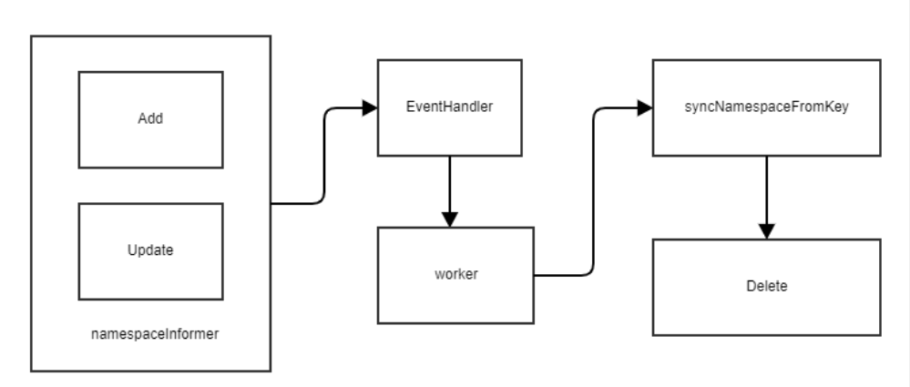
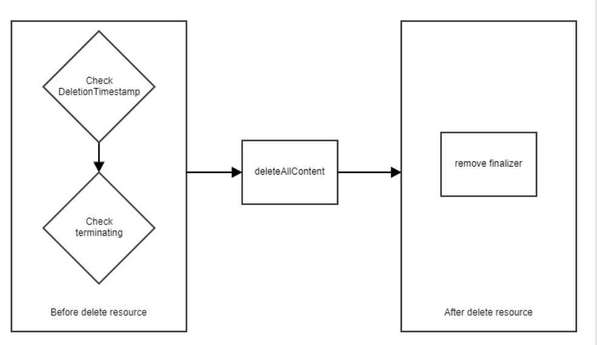

# Overview

这篇文章是基于Kubernetes的master  commitid:  8e8b6a01cf6bf55dea5e2e4f554597a95c82988a写下的源码分析文档。

此篇文档主要是围绕namespace controller的介绍以及工作原理。

代码位置 `pkg/controller/namespace`

# 概念

namespace 是一个从**逻辑**上划分隔离资源的一个组。使用namespace可以实现一种类似多租户的概念(包括隔离pod/deployment等资源，不同namespace不同权限，限制不同资源的quota等)

在Kubernetes中，我们会使用namespace来实现多个虚拟集群。在namespace中，资源的名称是唯一的。但是并非所有资源对象都是属于namespace scope的，例如PV。

# 数据结构

一个Namespace的name必须是DNS 兼容的标签；

一个Namepsace必须先创建，然后存在该namespace的资源例如pod才能被创建。


```go
type Namespace struct {
  TypeMeta   `json:",inline"`
  ObjectMeta `json:"metadata,omitempty"`

  Spec NamespaceSpec `json:"spec,omitempty"`
  Status NamespaceStatus `json:"status,omitempty"`
}
```

## Phases

Namespace有两种Phase， 默认是Active， 只有当namespace.ObjectMeta.DeletionTimestamp不为空的时候Phase就变成Terminating。

Active: 当一个Namespace被创建的时候，就默认是Active状态。

Terminating: 当该Namespace被执行了DELETE request的时候，` namespace.ObjectMeta.DeletionTimestamp` 就会被置为当前时间，然后`Namespace.Status.Phase` 则被置为Terminating.

```go
type NamespacePhase string
const(
  NamespaceActive NamespacePhase = "Active"
  NamespaceTerminating NamespacePhase = "Terminating"
)

type NamespaceStatus struct { 
  ...
  Phase NamespacePhase 
}
```


# 实例化Namespace Controller

该控制器监听了`namespaceInformer`对象资源的监听的增改事件。

```go
func NewNamespaceController(...) *NamespaceController { 
	namespaceInformer.Informer().AddEventHandlerWithResyncPeriod(
		cache.ResourceEventHandlerFuncs{
			AddFunc: func(obj interface{}) {
				namespace := obj.(*v1.Namespace)
				namespaceController.enqueueNamespace(namespace)
			},
			UpdateFunc: func(oldObj, newObj interface{}) {
				namespace := newObj.(*v1.Namespace)
				namespaceController.enqueueNamespace(namespace)
			},
		},		
	)
	return namespaceController
}
```


# Run

在Namespace Controller Run方法中，主要是运行了worker去处理来自namespace的增改事件。



```go
func (nm *NamespaceController) Run(workers int, stopCh <-chan struct{}) {
    ...
	for i := 0; i < workers; i++ {
        // 使用go协程调worker方法处理workqueue的namespace增改事件
		go wait.Until(nm.worker, time.Second, stopCh)
	}
	<-stopCh
}

// worker处理命名空间对象的队列。
//每个namespace最多只能在队列中出现一次。
//系统确保没有两个worker可以同时处理相同的名称空间。
func (nm *NamespaceController) worker() {
	workFunc := func() bool {
		key, quit := nm.queue.Get()
		if quit {
			return true
		}
		defer nm.queue.Done(key)
		// 执行syncNamespaceFromKey
		err := nm.syncNamespaceFromKey(key.(string))
		if err == nil {
			nm.queue.Forget(key)
			return false
		}

		if estimate, ok := err.(*deletion.ResourcesRemainingError); ok {
			t := estimate.Estimate/2 + 1

			nm.queue.AddAfter(key, time.Duration(t)*time.Second)
		} else {
			nm.queue.AddRateLimited(key)
			utilruntime.HandleError(fmt.Errorf("deletion of namespace %v failed: %v", key, err))
		}
		return false
	}

	for {
		quit := workFunc()

		if quit {
			return
		}
	}
}


// syncNamespaceFromKey在它的存储中寻找具有指定键的namespace并同步它
func (nm *NamespaceController) syncNamespaceFromKey(key string) (err error) {
	namespace, err := nm.lister.Get(key)
	return nm.namespacedResourcesDeleter.Delete(namespace.Name)
}

```


# 删除namespace

namespace被删除，有两个很重要的字段：

ObjectMeta.DeletionTimestamp: 一旦我们对一个namespace执行Delete操作，那么Kubernetes就会将当前的时间写入namespace的ObjectMeta.DeletionTimestamp。

Spec.Finalizers: 当namespace中的所有资源都被删除之后，就会从namespace移除该字段。


## Delete方法

从上面的数据结构的namespacedResourcesDeleter deletion.NamespacedResourcesDeleterInterface我们看到了如果删除namespace的话是调了NamespacedResourcesDeleterInterface接口，接下来我们看看该接口

代码位置 `pkg/controller/namespace/deletion/namespaced_resources_deleter.go`

`Delete`方法的主要逻辑是删除给定名称空间中的所有资源。

删除资源前:

​	它确保删除时间戳DeletionTimestamp在namespace(如果缺失删除时间戳，则不执行任何操作)。

​	验证名称空间是否处于“terminating”阶段 (更新namespace阶段，如果它还没有被标记为terminating)

删除资源:

​	调用deleteAllContent删除资源

删除资源后:

​	从给定的namespace中移除finalizer token 。

如果其中任何一个步骤失败，返回错误。 

但是如果正在删除资源的时候是会等待删除成功为止，否则就返回ResourcesRemainingError

这也是我们经常可以看到namespace Terminating的原因之一。




```go
type NamespacedResourcesDeleterInterface interface {
	Delete(nsName string) error
}


func (d *namespacedResourcesDeleter) Delete(nsName string) error {
	// 获取namespace对象，确保获取对象的时候对象存在，没有被其他worker controlller在处理。如果DeletionTimestamp字段非空，说明不需要删除
	namespace, err := d.nsClient.Get(context.TODO(), nsName, metav1.GetOptions{})
	if err != nil {
		if errors.IsNotFound(err) {
			return nil
		}
		return err
	}
	if namespace.DeletionTimestamp == nil {
		return nil
	}


    // d.updateNamespaceStatusFunc 这个方法是deepcopy namespace, 把namespace的Status.Phase改成NamespaceTerminating并且返回该namespace
    // 然后retryOnConflictError拿着目前的namespace对象跟d.updateNamespaceStatusFunc 返回的改了status.phase的namespace对象，先看看能否拿到目前的namespace，如果拿不到就说明被删掉，然后查看是否有冲突的错误。
	namespace, err = d.retryOnConflictError(namespace, d.updateNamespaceStatusFunc)
	if err != nil {
		if errors.IsNotFound(err) {
			return nil
		}
		return err
	}

	// the latest view of the namespace asserts that namespace is no longer deleting..
	if namespace.DeletionTimestamp.IsZero() {
		return nil
	}

    // 判断namespace.Spec.Finalizers 的长度是否为空
	if finalized(namespace) {
		return nil
	}
	
    // 跳转到deleteAllContent去找需要删除的资源并且删除
	estimate, err := d.deleteAllContent(namespace)
	if err != nil {
		return err
	}
	if estimate > 0 {
		return &ResourcesRemainingError{estimate}
	}

	// we have removed content, so mark it finalized by us
	_, err = d.retryOnConflictError(namespace, d.finalizeNamespace)
	if err != nil {
		if errors.IsNotFound(err) {
			return nil
		}
		return err
	}
	return nil
}

```


## deleteAllContent 发现需要删除的资源GVR

`deleteAllContent`首先使用了DiscoveryClient去发现在特定namespace中的所有资源以及资源的Group Version，传递给deleteAllContentForGroupVersionResource去执行删除逻辑。返回的是剩余资源被删除之前的估计数量，如果估计数量大于0，也就是说仍然有资源没有被删除。

```go
func (d *namespacedResourcesDeleter) deleteAllContent(ns *v1.Namespace) (int64, error) {
	namespace := ns.Name
	namespaceDeletedAt := *ns.DeletionTimestamp
	var errs []error
	conditionUpdater := namespaceConditionUpdater{}
	estimate := int64(0)

    // d.discoverResourcesFn()这个是namespacedResourcesDeleter对象的discoverResourcesFn字段，这个是属于metav1.APIResourceList
	resources, err := d.discoverResourcesFn()
	if err != nil {
        // 如果有错交给ProcessDiscoverResourcesErr处理		
		errs = append(errs, err)
		conditionUpdater.ProcessDiscoverResourcesErr(err)
	}
	
    // discovery这里是用了client-go里面的Discoveryclient发现客户端去发现K8S api server支持的GVR
    // 这里是使用DicoveryClient去查找传入的resources里面Verbs操作是delete的资源
    // 然后调用discovery.GroupVersionResources把该资源的GVR拿到
	deletableResources := discovery.FilteredBy(discovery.SupportsAllVerbs{Verbs: []string{"delete"}}, resources)
	groupVersionResources, err := discovery.GroupVersionResources(deletableResources)
    
	...

	numRemainingTotals := allGVRDeletionMetadata{
		gvrToNumRemaining:        map[schema.GroupVersionResource]int{},
		finalizersToNumRemaining: map[string]int{},
	}
    // 轮询上面拿到的Verbs操作是delete的资源的GVR，把namespace, gvr, 删除事件戳传给deleteAllContentForGroupVersionResource方法
	for gvr := range groupVersionResources {
		gvrDeletionMetadata, err := d.deleteAllContentForGroupVersionResource(gvr, namespace, namespaceDeletedAt)
		...
		if gvrDeletionMetadata.finalizerEstimateSeconds > estimate {
			estimate = gvrDeletionMetadata.finalizerEstimateSeconds
		}
		if gvrDeletionMetadata.numRemaining > 0 {
			numRemainingTotals.gvrToNumRemaining[gvr] = gvrDeletionMetadata.numRemaining
			for finalizer, numRemaining := range gvrDeletionMetadata.finalizersToNumRemaining {
				if numRemaining == 0 {
					continue
				}
				numRemainingTotals.finalizersToNumRemaining[finalizer] = numRemainingTotals.finalizersToNumRemaining[finalizer] + numRemaining
			}
		}
	}
	conditionUpdater.ProcessContentTotals(numRemainingTotals)

	if hasChanged := conditionUpdater.Update(ns); hasChanged {
		if _, err = d.nsClient.UpdateStatus(context.TODO(), ns, metav1.UpdateOptions{}); err != nil {
			utilruntime.HandleError(fmt.Errorf("couldn't update status condition for namespace %q: %v", namespace, err))
		}
	}

	// if len(errs)==0, NewAggregate returns nil.
	return estimate, utilerrors.NewAggregate(errs)
}

```


## deleteAllContentForGroupVersionResource

deleteAllContentForGroupVersionResource将使用DynamicClient删除在gvr中标识的每个资源。它返回在剩余资源被删除之前剩余时间的估计数。

DynamicClient是动态的客户端，可以对任意的K8S API对象执行通用操作，包括CRD自定义资源。

```go
func (d *namespacedResourcesDeleter) deleteAllContentForGroupVersionResource(
	gvr schema.GroupVersionResource, namespace string,
	namespaceDeletedAt metav1.Time) (gvrDeletionMetadata, error) {
    // deleteCollection方法是通过使用https://godoc.org/k8s.io/client-go/metadata中接口去判断该资源GVR是否支持DeleteCollection
	deleteCollectionSupported, err := d.deleteCollection(gvr, namespace)
	if err != nil {
		return gvrDeletionMetadata{finalizerEstimateSeconds: estimate}, err
	}

    // 如果不支持DeleteCollection，那么我们就调用deleteEachItem去list并且删除	
	if !deleteCollectionSupported {
		err = d.deleteEachItem(gvr, namespace)
	}
	
	unstructuredList, listSupported, err := d.listCollection(gvr, namespace)	
    // 使用列表查找 finalizers
	finalizersToNumRemaining := map[string]int{}
	for _, item := range unstructuredList.Items {
		for _, finalizer := range item.GetFinalizers() {
			finalizersToNumRemaining[finalizer] = finalizersToNumRemaining[finalizer] + 1
		}
	}

    // 统计最后还有多少资源没有被删除
	if estimate != int64(0) {
		return gvrDeletionMetadata{
			finalizerEstimateSeconds: estimate,
			numRemaining:             len(unstructuredList.Items),
			finalizersToNumRemaining: finalizersToNumRemaining,
		}, nil
	}

	// if any item has a finalizer, we treat that as a normal condition, and use a default estimation to allow for GC to complete.
	if len(finalizersToNumRemaining) > 0 {
		return gvrDeletionMetadata{
			finalizerEstimateSeconds: finalizerEstimateSeconds,
			numRemaining:             len(unstructuredList.Items),
			finalizersToNumRemaining: finalizersToNumRemaining,
		}, nil
	}

	return gvrDeletionMetadata{
		finalizerEstimateSeconds: estimate,
		numRemaining:             len(unstructuredList.Items),
	}, fmt.Errorf("unexpected items still remain in namespace: %s for gvr: %v", namespace, gvr)
}
```


## deleteEachItem 删除真正的资源

```go
func (d *namespacedResourcesDeleter) deleteEachItem(gvr schema.GroupVersionResource, namespace string) error {
	unstructuredList, listSupported, err := d.listCollection(gvr, namespace)
...
    // 最重要的真正的删除，调用了metadataClient去一个一个的Delete
	for _, item := range unstructuredList.Items {
		background := metav1.DeletePropagationBackground
		opts := metav1.DeleteOptions{PropagationPolicy: &background}
		if err = d.metadataClient.Resource(gvr).Namespace(namespace).Delete(context.TODO(), item.GetName(), opts); err != nil && !errors.IsNotFound(err) && !errors.IsMethodNotSupported(err) {
			return err
		}
	}
	return nil
}
```


# 总结

Namespace Controller一直循环检查namespace资源对象的新增或变化，一旦发现DeletionTimestamp非空，就将该资源对象设置成terminating，然后调用DiscoveryClient去发现该namespace中的所有资源，再调用DynamicClient去将资源删除，最后在namespace中移除Finalizer。


