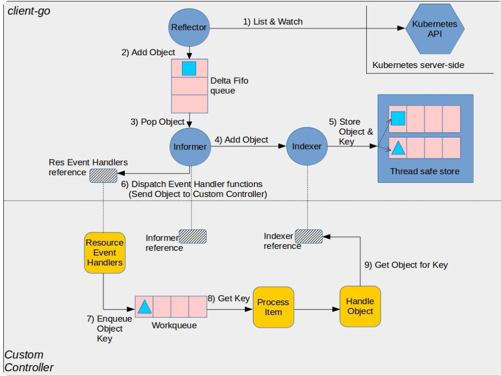

# Overview

这篇文章是基于Kubernetes的master  commitid:  8e8b6a01cf6bf55dea5e2e4f554597a95c82988a写下的源码分析文档。

此篇文档主要是围绕StatefulSet controller的介绍以及工作原理。

代码位置 `pkg/controller/statefulset`


# 概念

在Kubernetes早期的时候，是没有对有状态应用的支持，我们只是把无状态的应用放在Kubernetes上，而将有状态应用更多是部署在VM上，用传统的方式进行管理。对有状态应用来说，典型的数据库之类的应用，我们可以使用Deployment, 只是部署replicase=1的一个来进行将有状态的应用部署进Kubernetes，但这样的话不可靠，容易造成数据丢失，并且有状态应用对底层例如存储需求，是每一个实例都希望是专用的。在这种状态下引入了StatefulSet。

StatefulSet是用来管理**有状态应用**的 API 对象。StatefulSet 用来管理 Deployment 和扩展一组 Pod，并且能为这些 Pod 提供*序号和唯一性保证*。

和 Deployment 相同的是，StatefulSet 管理了基于相同容器定义的一组 Pod。但和 Deployment 不同的是，StatefulSet 为它们的每个 Pod 维护了一个固定的 ID。这些 Pod 是基于相同的声明来创建的，但是不能相互替换：无论怎么调度，每个 Pod 都有一个永久不变的 ID。


# StatefulSet Controller

StatefuleSetController是对所有StatefuleSet的检查控制。

## 数据结构

代码位置`pkg/controller/statefulset/stateful_set.go` 

从以下的的数据结构，我们可以看到StatefulSetController监听了Pod, StatefulSet, PVC的事件。

```go
type StatefulSetController struct {
	kubeClient clientset.Interface
	control StatefulSetControlInterface
	podControl controller.PodControlInterface
	podLister corelisters.PodLister
	podListerSynced cache.InformerSynced
	setLister appslisters.StatefulSetLister
	setListerSynced cache.InformerSynced
	pvcListerSynced cache.InformerSynced
	revListerSynced cache.InformerSynced
	queue workqueue.RateLimitingInterface
}
```


## 实例化StatefulSetController

```go
func NewStatefulSetController(
	podInformer coreinformers.PodInformer,
	setInformer appsinformers.StatefulSetInformer,
	pvcInformer coreinformers.PersistentVolumeClaimInformer,
	revInformer appsinformers.ControllerRevisionInformer,
	kubeClient clientset.Interface,
) *StatefulSetController {    
    // 实例化Event消费者 NewBroadcaster
	eventBroadcaster := record.NewBroadcaster()
	eventBroadcaster.StartStructuredLogging(0)
	eventBroadcaster.StartRecordingToSink(&v1core.EventSinkImpl{Interface: kubeClient.CoreV1().Events("")})
	recorder := eventBroadcaster.NewRecorder(scheme.Scheme, v1.EventSource{Component: "statefulset-controller"})

    // 实例化StatefulSetController
	ssc := &StatefulSetController{
		kubeClient: kubeClient,
        // 默认注册的是NewDefaultStatefulSetControl 控制器，因此在后面的syncStatefulSet是使用了NewDefaultStatefulSetControl控制器
		control: NewDefaultStatefulSetControl(
			NewRealStatefulPodControl(
				kubeClient,
				setInformer.Lister(),
				podInformer.Lister(),
				pvcInformer.Lister(),
				recorder),
			NewRealStatefulSetStatusUpdater(kubeClient, setInformer.Lister()),
			history.NewHistory(kubeClient, revInformer.Lister()),
			recorder,
		),
		pvcListerSynced: pvcInformer.Informer().HasSynced,
		queue:           workqueue.NewNamedRateLimitingQueue(workqueue.DefaultControllerRateLimiter(), "statefulset"),
		podControl:      controller.RealPodControl{KubeClient: kubeClient, Recorder: recorder},

		revListerSynced: revInformer.Informer().HasSynced,
	}

    // 监听podInformer过来的事件去消费，包括增删改
	podInformer.Informer().AddEventHandler(cache.ResourceEventHandlerFuncs{		
		AddFunc: ssc.addPod,		
		UpdateFunc: ssc.updatePod,		
		DeleteFunc: ssc.deletePod,
	})
	ssc.podLister = podInformer.Lister()
	ssc.podListerSynced = podInformer.Informer().HasSynced

    // 监听StatefulSet过来的事件去消费，包括增删改，改的这里会不断循环让Status.Rplicas达到预期
	setInformer.Informer().AddEventHandler(
		cache.ResourceEventHandlerFuncs{
			AddFunc: ssc.enqueueStatefulSet,
			UpdateFunc: func(old, cur interface{}) {
				oldPS := old.(*apps.StatefulSet)
				curPS := cur.(*apps.StatefulSet)
				if oldPS.Status.Replicas != curPS.Status.Replicas {
					klog.V(4).Infof("Observed updated replica count for StatefulSet: %v, %d->%d", curPS.Name, oldPS.Status.Replicas, curPS.Status.Replicas)
				}
				ssc.enqueueStatefulSet(cur)
			},
			DeleteFunc: ssc.enqueueStatefulSet,
		},
	)
	ssc.setLister = setInformer.Lister()
	ssc.setListerSynced = setInformer.Informer().HasSynced

	// TODO: Watch volumes
	return ssc
}

```

### enqueueStatefulSet

在实例化StatefulSet Controller的时候，可以看见同时持续使用`Reflector`建立长连接，去`Watch` API Server发来的资源变更事件： 包括pod资源的增删改，statefulset资源的增删改以及pvc资源。

我们拿了Pod 删除资源的方法，修剪枝丫，我们可以看见这里最关键的是调用了一个叫`enqueueStatefulSet`的方法，并且我们再去看Pod的增改或者StatefulSet 资源的增删改都会调用`enqueueStatefulSet`方法，我们分析下这个方法。

```go
func (ssc *StatefulSetController) deletePod(obj interface{}) {
	pod, ok := obj.(*v1.Pod)
	controllerRef := metav1.GetControllerOf(pod)
	set := ssc.resolveControllerRef(pod.Namespace, controllerRef)
	ssc.enqueueStatefulSet(set)
}

```


`enqueueStatefulSet` 这个方法实际上是做了一个非常重要而简单的操作，就是把事件插入到workqueue中

```go
func (ssc *StatefulSetController) enqueueStatefulSet(obj interface{}) {
	key, err := controller.KeyFunc(obj)
	ssc.queue.Add(key)
}
```


## 运行StatefulSetController

```go
func (ssc *StatefulSetController) Run(workers int, stopCh <-chan struct{}) {
...
	if !cache.WaitForNamedCacheSync("stateful set", stopCh, ssc.podListerSynced, ssc.setListerSynced, ssc.pvcListerSynced, ssc.revListerSynced) {
		return
	}

	for i := 0; i < workers; i++ {
        // 使用go协程去并行执行worker
		go wait.Until(ssc.worker, time.Second, stopCh)
	}

	<-stopCh
}
// worker实际是执行了processNextWorkItem方法
func (ssc *StatefulSetController) worker() {
	for ssc.processNextWorkItem() {
	}
}

//然后processNextWorkItem是读取了workqueue中的元素，去执行sync
func (ssc *StatefulSetController) processNextWorkItem() bool {
	key, quit := ssc.queue.Get()
	if quit {
		return false
	}
	defer ssc.queue.Done(key)
	if err := ssc.sync(key.(string)); err != nil {
		utilruntime.HandleError(fmt.Errorf("error syncing StatefulSet %v, requeuing: %v", key.(string), err))
		ssc.queue.AddRateLimited(key)
	} else {
		ssc.queue.Forget(key)
	}
	return true
}
```

我们从上述代码可以看见，Kubernetes在死循环的执行了`processNextWorkItem`方法，而`processNextWorkItem`是读取了`workqueue`中的元素，去执行`sync`。


## sync

`sync`的代码块里面调用`UpdateStatefulSet`去更新StatefulSet和Pods。

```go
func (ssc *StatefulSetController) sync(key string) error {
	startTime := time.Now()
...

	namespace, name, err := cache.SplitMetaNamespaceKey(key)

    // 从store缓存中读取该statefulset
	set, err := ssc.setLister.StatefulSets(namespace).Get(name)
...
    // 拿到Statefulset对象的Spec.Selector
	selector, err := metav1.LabelSelectorAsSelector(set.Spec.Selector)
...

	if err := ssc.adoptOrphanRevisions(set); err != nil {
		return err
	}

    // getPodsForStatefulSet 获取owner reference是属于该StatefulSet的pod list
	pods, err := ssc.getPodsForStatefulSet(set, selector)
	if err != nil {
		return err
	}

    // 通过syncStatefulSet 去比对StatefulSet 与 属于该对象的pods list
	return ssc.syncStatefulSet(set, pods)
}

func (ssc *StatefulSetController) syncStatefulSet(set *apps.StatefulSet, pods []*v1.Pod) error {
    //  调用UpdateStatefulSet去更新statefulSet和pods
	if err := ssc.control.UpdateStatefulSet(set.DeepCopy(), pods); err != nil {
		return err
	}	
	return nil
}
```


### UpdateStatefulSet

这是整个statefulSet controller最重要的逻辑处理，具体可见总结

```go
func (ssc *defaultStatefulSetControl) UpdateStatefulSet(set *apps.StatefulSet, pods []*v1.Pod) error {

	// list all revisions and sort them
	revisions, err := ssc.ListRevisions(set)
	history.SortControllerRevisions(revisions)
	// 执行 performUpdate
	currentRevision, updateRevision, err := ssc.performUpdate(set, pods, revisions)

	// maintain the set's revision history limit
	return ssc.truncateHistory(set, pods, revisions, currentRevision, updateRevision)
}
```


#### performUpdate

在详细讲performUpdate方法之前，需要先理解什么是ControllerRevision， ControllerRevision存储的是对象的State数据的不可变快照， ControllerRevision一旦创建成功就不能再更新，但是ControllerRevisions可以被删除，DaemonSet和StatefulSet控制器都使用ControllerRevision来更新和回滚。

```go
func (ssc *defaultStatefulSetControl) performUpdate(
	set *apps.StatefulSet, pods []*v1.Pod, revisions []*apps.ControllerRevision) (*apps.ControllerRevision, *apps.ControllerRevision, error) {

	// 拿到当前的revision 以及如果有冲突被递增后的updateRevision，
	currentRevision, updateRevision, collisionCount, err := ssc.getStatefulSetRevisions(set, revisions)
	if err != nil {
		return currentRevision, updateRevision, err
	}

    // 详细看下方的updateStatefulSet， 是执行更新的函数以及获取更新后的状态	
	status, err := ssc.updateStatefulSet(set, currentRevision, updateRevision, collisionCount, pods)
	if err != nil {
		return currentRevision, updateRevision, err
	}

	// update the set's status
	err = ssc.updateStatefulSetStatus(set, status)
	if err != nil {
		return currentRevision, updateRevision, err
	}
...
	return currentRevision, updateRevision, nil
}
```


##### updateStatefulSet

执行更新的函数以及返回更新后的状态。

updateStatefulSet对StatefuleSet执行更新函数。这个方法创建、更新和删除Pods。

该set以使系统符合目标状态为集合。目标状态总是包含 set.Spec.Replicas 的Pods达到一个Ready的状态。

```go
func (ssc *defaultStatefulSetControl) updateStatefulSet(
	set *apps.StatefulSet,
	currentRevision *apps.ControllerRevision,
	updateRevision *apps.ControllerRevision,
	collisionCount int32,
	pods []*v1.Pod) (*apps.StatefulSetStatus, error) {
	
    // 从当前revision的statefulset的快照获取statefuleset
	currentSet, err := ApplyRevision(set, currentRevision)
	// 从更新的revision 的statefulset的快照获取statefuleset
	updateSet, err := ApplyRevision(set, updateRevision)


	// set the generation, and revisions in the returned status
	status := apps.StatefulSetStatus{}
	status.ObservedGeneration = set.Generation
	status.CurrentRevision = currentRevision.Name
	status.UpdateRevision = updateRevision.Name
	status.CollisionCount = new(int32)
	*status.CollisionCount = collisionCount

	replicaCount := int(*set.Spec.Replicas)
	
    // 这是一个slice，类型存储Pod对象类型，数量是statefulset.Spec.Replicas
	replicas := make([]*v1.Pod, replicaCount)
    // 存储着pod对象类型，容量是owner reference属于这个statefulset的pod的数量大小的slice
	condemned := make([]*v1.Pod, 0, len(pods))
	unhealthy := 0
	firstUnhealthyOrdinal := math.MaxInt32
	var firstUnhealthyPod *v1.Pod

	// First we partition pods into two lists valid replicas and condemned Pods
	for i := range pods {
        // 统计目前已经有的owner reference 属于该Statefulset的pods数量
		status.Replicas++
		
        // 统计已经ready的 owner reference 属于该Statefulset的pods数量
		if isRunningAndReady(pods[i]) {
			status.ReadyReplicas++
		}
		
        // 判断pod的Status是否为空   以及判断pod的DeletionTimestamp是否为空
		if isCreated(pods[i]) && !isTerminating(pods[i]) {
            // 判断pod的label里面的controller-revision-hash值是否跟当前revision.name一致如果是则CurrentReplicas自增
			if getPodRevision(pods[i]) == currentRevision.Name {
				status.CurrentReplicas++
			}
			if getPodRevision(pods[i]) == updateRevision.Name {
				status.UpdatedReplicas++
			}
		}

        // getOrdinal是返回pod的序号，如果pod没有序号则返回-1(这里不处理ord小于0的pod)
        // 如果pod的序号在当前副本数量的范围内，将其插入序号的间接位置         
		if ord := getOrdinal(pods[i]); 0 <= ord && ord < replicaCount {			
			replicas[ord] = pods[i]

            // 如果序数大于副本的数量，则将其添加到condemned列表中
		} else if ord >= replicaCount {
			condemned = append(condemned, pods[i])
		}		
	}
// 经过上述把所有owner reference属于该statefulset的pod轮询，获取到所有replicas.pod的数量，statefulset.replicas.ready.pod的数量，按pod的序号排列的relicas的列表replicas，以及超过replicaCount的pod的列表condemned
    
	
	for ord := 0; ord < replicaCount; ord++ {
        // 如果replicas的pod对象是空，那么调用newVersionedStatefulSetPod对当前revision 创建pod
        // 这里可以清晰看见，创建是按顺序创建
		if replicas[ord] == nil {
			replicas[ord] = newVersionedStatefulSetPod(
				currentSet,
				updateSet,
				currentRevision.Name,
				updateRevision.Name, ord)
		}
	}

	
    // 对condemned列表（存储的是序数大于副本的数量的pod）排序
	sort.Sort(ascendingOrdinal(condemned))
	
    // 找到第一个unhealthy的pod
	for i := range replicas {
		if !isHealthy(replicas[i]) {
			unhealthy++
			if ord := getOrdinal(replicas[i]); ord < firstUnhealthyOrdinal {
				firstUnhealthyOrdinal = ord
				firstUnhealthyPod = replicas[i]
			}
		}
	}

	for i := range condemned {
		if !isHealthy(condemned[i]) {
			unhealthy++
			if ord := getOrdinal(condemned[i]); ord < firstUnhealthyOrdinal {
				firstUnhealthyOrdinal = ord
				firstUnhealthyPod = condemned[i]
			}
		}
	}
    // allowsBurst是检查statefulset.Spec.PodManagementPolicy 是否是Parallel， 如果是，则说明需要等待所有的pod再一起mark成ready
	monotonic := !allowsBurst(set)

	for i := range replicas {
		// delete and recreate failed pods
        // 如果pod的状态是fail
		if isFailed(replicas[i]) {
			// 那么尝试删除该pod
			if err := ssc.podControl.DeleteStatefulPod(set, replicas[i]); err != nil {
				return &status, err
			}
            // 并且对CurrentReplicas自减
			if getPodRevision(replicas[i]) == currentRevision.Name {
				status.CurrentReplicas--
			}
			if getPodRevision(replicas[i]) == updateRevision.Name {
				status.UpdatedReplicas--
			}
			status.Replicas--
            // 因为上面我们已经对这个Fail的pod尝试删除了，然后我们现在再重新创建这个有问题的pod
			replicas[i] = newVersionedStatefulSetPod(
				currentSet,
				updateSet,
				currentRevision.Name,
				updateRevision.Name,
				i)
		}
		
        // isCreated是判断pod.Status.Phase 是否为非空，也就是判断这个pod是否已经被创建。 !isCreated(replicas[i])意思是找 pod.Status.Phase是空的pod， 然后调用CreateStatefulPod去创建pvc,创建pod
		if !isCreated(replicas[i]) {
			if err := ssc.podControl.CreateStatefulPod(set, replicas[i]); err != nil {
				return &status, err
			}
			status.Replicas++
			if getPodRevision(replicas[i]) == currentRevision.Name {
				status.CurrentReplicas++
			}
			if getPodRevision(replicas[i]) == updateRevision.Name {
				status.UpdatedReplicas++
			}

			// if the set does not allow bursting, return immediately
			if monotonic {
				return &status, nil
			}
			continue
		}
		
        // 检查statefulset的 pod.DeletionTimestamp是否为空, 如果是非空，则说明该pod正在被terminate， 然后我们需要等待这个pod的删除完成        
		if isTerminating(replicas[i]) && monotonic {
            return &status, nil
		}

		// ordinal, are Running and Ready.
        // 如果pod没有running或者ready的话，那么返回等待
		if !isRunningAndReady(replicas[i]) && monotonic {
			return &status, nil
		}
        
		
        // 检查pod.name, namespace, label正确
        // 如果statefulset的pod使用了PVC， 保证该pod挂载了正确的volume, pvc
        // 这里请跳转到总结里面的Pod名词标签
		if identityMatches(set, replicas[i]) && storageMatches(set, replicas[i]) {
			continue
		}

        // 使用deep copy 更新pod的状态，而不是更改从cache读出来的statefulset
		replica := replicas[i].DeepCopy()
		if err := ssc.podControl.UpdateStatefulPod(updateSet, replica); err != nil {
			return &status, err
		}
	}


    // 对condemned列表（存储的是序数大于副本的数量的pod）按顺序单调递减的顺序终止Pods
    // 当删除 Pod 时，它们是逆序终止的，顺序为 N-1..0
	for target := len(condemned) - 1; target >= 0; target-- {
		if isTerminating(condemned[target]) {
			// block if we are in monotonic mode
			if monotonic {
				return &status, nil
			}
			continue
		}
		// if we are in monotonic mode and the condemned target is not the first unhealthy Pod block
		if !isRunningAndReady(condemned[target]) && monotonic && condemned[target] != firstUnhealthyPod {
			return &status, nil
		}

		if err := ssc.podControl.DeleteStatefulPod(set, condemned[target]); err != nil {
			return &status, err
		}
		if getPodRevision(condemned[target]) == currentRevision.Name {
			status.CurrentReplicas--
		}
		if getPodRevision(condemned[target]) == updateRevision.Name {
			status.UpdatedReplicas--
		}
		if monotonic {
			return &status, nil
		}
	}

    // 检查statefuleset的Spec.UpdateStrategy，如果属于删除策略，则不更新pod, 直接返回
    // apps.OnDeleteStatefulSetStrategyType 值是 "OnDelete"， 具体可以看总结里面更新策略中的删除策略
	if set.Spec.UpdateStrategy.Type == apps.OnDeleteStatefulSetStrategyType {
		return &status, nil
	}

    // 检查statefulset的.Spec.UpdateStrategy.RollingUpdate， 如果不为空，则计算分区的大小， 详细可以看更新策略中的分区
	updateMin := 0
	if set.Spec.UpdateStrategy.RollingUpdate != nil {
		updateMin = int(*set.Spec.UpdateStrategy.RollingUpdate.Partition)
	}
	// 所有序号大于等于该分区序号的 Pod都会先被terminate
	for target := len(replicas) - 1; target >= updateMin; target-- {
		if getPodRevision(replicas[target]) != updateRevision.Name && !isTerminating(replicas[target]) {			
			err := ssc.podControl.DeleteStatefulPod(set, replicas[target])
			status.CurrentReplicas--
			return &status, err
		}

		// wait for unhealthy Pods on update
        // 等待被更新中的不健康的pod，如果不健康则返回，否则说明该pod健康，然后更新下一个
		if !isHealthy(replicas[target]) {			
			return &status, nil
		}

	}
	return &status, nil
}

```


# 总结

## Client-go总结

Statefulset Controller的代码是一个很典型的使用了Client-go流程控制器代码。

它在实例化Statefulset controller的时候，就启动share informer中的pod informer, statefulset informer和pvc informer。

`Reflector`反射器不断的去Watch 来自API Server中资源变更事件，当Pod资源对象/StatefulSet资源对象和PVC资源对象有增删改操作，就马上把资源对象放入`DeltaFIFO`中。

当先进先出的`DeltaFIFO`对象有数据的时候，就马上被Pop到Statefulset controller 中，而controller猝发了`processNextWorkItem`函数去处理。

具体流程可以见下图（图来自Client-go官网）




## Pod 标识

StatefulSet Pod 具有唯一的标识，该标识包括顺序标识、稳定的网络标识和稳定的存储。该标识和 Pod 是绑定的，不管它被调度在哪个节点上。

### 有序索引

从上方我们从replicas的列表按顺序轮询，调用了`if err := ssc.podControl.CreateStatefulPod(set, replicas[i]); err != nil {` 来创建pod， 可以确定如下：

对于具有 N 个副本的 StatefulSet，StatefulSet 中的每个 Pod 将被分配一个整数序号，从 0 到 N-1，该序号在 StatefulSet 上是唯一的。

例如我创建一个名为consul, replicas是3的StatefulSet ， 那么StatefulSet controller就会帮我创建consul-0, consul-1, consul-2的pod。


#### 创建Pod

与我们熟悉的Deployment对比， Deployment创建的Pod(严谨来说是属于该Deployment的RS创建的Pod)名称是不稳定的，名字后缀是一个随机的字符串，而有状态的应用StatefulSet创建的每一个Pod都有一个稳定的名称：对于包含 N 个 副本的 StatefulSet，当部署 Pod 时，它们是依次创建的，顺序为 `0..N-1`。

先检查Pod是否有PVC的需求，如果没有，那么根据调度器算法来创建Pod，如果有，那么先调createPersistentVolumeClaims创建PVC, 如果是EBS之类，那么当PVC已经存在的话，直接返回，并且根据亲和性，Pod被调度器的亲和性来原地创建该Pod, 如果PVC不存在，先创建PVC， 然后Volume controller会负责attach volume到node, 然后创建Pod再执行Mount的操作。

```go
func (ssc *defaultStatefulSetControl) updateStatefulSet() {    
    ...
    // 轮询 replicas这里调用CreateStatefulPod创建pod
    for i := range replicas {
        ...
        if !isCreated(replicas[i]) {
			if err := ssc.podControl.CreateStatefulPod(set, replicas[i]); err != nil {
				return &status, err
			}
        ...
}

func (spc *realStatefulPodControl) CreateStatefulPod(set *apps.StatefulSet, pod *v1.Pod) error {
    // 创建pod之前首先创建pod的PVC
	if err := spc.createPersistentVolumeClaims(set, pod); err != nil {
		spc.recordPodEvent("create", set, pod, err)
		return err
	}	
    // 然后创建pod
	_, err := spc.client.CoreV1().Pods(set.Namespace).Create(context.TODO(), pod, metav1.CreateOptions{})
	// sink already exists errors
	if apierrors.IsAlreadyExists(err) {
		return err
	}
	spc.recordPodEvent("create", set, pod, err)
	return err
}
```

#### 删除Pod

当删除 Pod 时，它们是逆序终止的，顺序为 `N-1..0` 

这里也可以看到，删除Pod是不会删除它关联的PVC的。

```go
func (ssc *defaultStatefulSetControl) updateStatefulSet() {
    // 将condemned 列表倒序排列
    sort.Sort(ascendingOrdinal(condemned))
    ...
    // 轮询condemned列表，去删除pod。
   // condemned 列表
    for target := len(condemned) - 1; target >= 0; target-- {    
        ...
        if err := ssc.podControl.DeleteStatefulPod(set, condemned[target]); err != nil {
			return &status, err
		}
}

func (spc *realStatefulPodControl) DeleteStatefulPod(set *apps.StatefulSet, pod *v1.Pod) error {
	err := spc.client.CoreV1().Pods(set.Namespace).Delete(context.TODO(), pod.Name, metav1.DeleteOptions{})
	spc.recordPodEvent("delete", set, pod, err)
	return err
}
```

从上方的代码我们可以看到，**当 Pod 或者 StatefulSet 被删除时，与 PersistentVolumeClaims 相关联的 PersistentVolume 并不会被删除。要删除它必须通过手动方式来完成**。这是考虑到一个实际的场景，有状态的应用例如数据库，存储是非常重要的，我们需要尽可能保证数据不被丢失，如果需要回收PVC的话需要手动删除。

### 稳定的存储

Kubernetes 为每个 VolumeClaimTemplate 创建一个 PersistentVolumes。 如果没有声明 StorageClass，就会使用默认的 StorageClass。 当一个 Pod 被调度（重新调度）到节点上时，它的 `volumeMounts` 会挂载与其 PersistentVolumeClaims 相关联的 PersistentVolume。 

#### 创建存储

StatefulSet跟Deployment在存储这里有几个不同点，其中一个就是StatefulSet并不是使用预定义的PVC， 而是通过volumeClaimTemplates来创建PVC。如果在一个StatefulSet创建完成之后，需要扩展，就可以使用这种机制来获得专用的PVC。 

注意，扩大StatefulSet是会创建新的Pod和相关的PVC, 但缩小规模会删除Pod, 而不会删除任何的PVC，也不会删除PV。（具体代码见上方的`DeleteStatefulPod`）

```go
func (spc *realStatefulPodControl) createPersistentVolumeClaims(set *apps.StatefulSet, pod *v1.Pod) error {
	var errs []error
	for _, claim := range getPersistentVolumeClaims(set, pod) {
		_, err := spc.pvcLister.PersistentVolumeClaims(claim.Namespace).Get(claim.Name)
		switch {
            // 如果pod的PVC已经存在则跳过，如果不存在那么创建该PVC
		case apierrors.IsNotFound(err):
			_, err := spc.client.CoreV1().PersistentVolumeClaims(claim.Namespace).Create(context.TODO(), &claim, metav1.CreateOptions{})
...
            // 如果获取pod的PVC报错，把错误返回
		case err != nil:
			errs = append(errs, fmt.Errorf("failed to retrieve PVC %s: %s", claim.Name, err))
			spc.recordClaimEvent("create", set, pod, &claim, err)
		}
	}
	return errorutils.NewAggregate(errs)
}
```


今天同事问我，StatefulSet 的Pod如果被删除，是否是原地重建？

答案是：取决于该podPod有持久化存储PVC以及PVC的类型。

如果没有PVC,那么交给调度器根据算法调度，不一定原地重建

如果有PVC, 并且是属于例如cloud类型的EBS就原地重建，因为PVC是已经被Attach到Node里面，如果是远程类型的PVC例如ceph，那么是调度器会不一定重建。


### Pod 名称标签

当 StatefulSet 控制器创建 Pod 时，它会添加一个标签 `statefulset.kubernetes.io/pod-name`，该标签设置为 Pod 名称。这个标签允许您给 StatefulSet 中的特定 Pod 绑定一个 Service。

```go
func identityMatches(set *apps.StatefulSet, pod *v1.Pod) bool {
	parent, ordinal := getParentNameAndOrdinal(pod)
	return ordinal >= 0 &&
		set.Name == parent &&
		pod.Name == getPodName(set, ordinal) &&
		pod.Namespace == set.Namespace &&
    // 这里确保给pod的增加label， 从https://godoc.org/k8s.io/api/apps/v1查可以看到 StatefulSetPodNameLabel        = "statefulset.kubernetes.io/pod-name"
		pod.Labels[apps.StatefulSetPodNameLabel] == pod.Name
}
```


## 部署和扩缩容

#### 并行 Pod 管理

`Parallel` Pod 管理让 StatefulSet 控制器并行的启动或终止所有的 Pod， 启动或者终止其他 Pod 前，无需等待 Pod 进入 Running 和 ready 或者完全停止状态。

```go
func allowsBurst(set *apps.StatefulSet) bool {
	return set.Spec.PodManagementPolicy == apps.ParallelPodManagement
}	

func (ssc *defaultStatefulSetControl) updateStatefulSet() {    
    ...
	monotonic := !allowsBurst(set)
    
    // 非在Parallel的条件下，我们希望创建的pod ready之后才往下走
    // 也就是说，Parallel就跳过等待ready了
    		if !isRunningAndReady(replicas[i]) && monotonic {
			klog.V(4).Infof(
				"StatefulSet %s/%s is waiting for Pod %s to be Running and Ready",
				set.Namespace,
				set.Name,
				replicas[i].Name)
			return &status, nil
		}
        ...
}

```

## 更新策略

### 删除策略

当 StatefulSet 的 `.spec.updateStrategy.type` 设置为 `OnDelete` 时，它的控制器将不会自动更新 StatefulSet 中的 Pod。用户必须手动删除 Pod 以便让控制器创建新的 Pod，以此来对 StatefulSet 的 `.spec.template` 的变动作出反应。

```go
func (ssc *defaultStatefulSetControl) updateStatefulSet() { 
    ...
    // 检查statefuleset的Spec.UpdateStrategy，如果属于删除策略，则不更新pod, 直接返回
    // apps.OnDeleteStatefulSetStrategyType 值是 "OnDelete"
    if set.Spec.UpdateStrategy.Type == apps.OnDeleteStatefulSetStrategyType {
		return &status, nil
	}
```


### 滚动更新

`RollingUpdate` 更新策略对 StatefulSet 中的 Pod 执行自动的滚动更新。在没有声明 `.spec.updateStrategy` 时，`RollingUpdate` 是默认配置。 当 StatefulSet 的 `.spec.updateStrategy.type` 被设置为 `RollingUpdate` 时，StatefulSet 控制器会删除和重建 StatefulSet 中的每个 Pod。 它将按照与 Pod 终止相同的顺序（从最大序号到最小序号）进行，每次更新一个 Pod。它会等到被更新的 Pod 进入 Running 和 Ready 状态，然后再更新其前面一个Pod。


#### 分区

通过声明 `.spec.updateStrategy.rollingUpdate.partition` 的方式，`RollingUpdate` 更新策略可以实现分区。如果声明了一个分区，当 StatefulSet 的 `.spec.template` 被更新时，所有序号大于等于该分区序号的 Pod 都会被更新。所有序号小于该分区序号的 Pod 都不会被更新，并且，即使他们被删除也会依据之前的版本进行重建。如果 StatefulSet 的 `.spec.updateStrategy.rollingUpdate.partition` 大于它的 `.spec.replicas`，对它的 `.spec.template` 的更新将不会传递到它的 Pod。 在大多数情况下，您不需要使用分区，但如果您希望进行阶段更新、执行金丝雀或执行分阶段展开，则这些分区会非常有用

```go
func (ssc *defaultStatefulSetControl) updateStatefulSet() { 
    ...
// 检查statefulset的.Spec.UpdateStrategy.RollingUpdate， 如果不为空，则计算分区的大小
	updateMin := 0
	if set.Spec.UpdateStrategy.RollingUpdate != nil {
		updateMin = int(*set.Spec.UpdateStrategy.RollingUpdate.Partition)
	}
	// 所有序号大于等于该分区序号的 Pod都会先被terminate
	for target := len(replicas) - 1; target >= updateMin; target-- {
		if getPodRevision(replicas[target]) != updateRevision.Name && !isTerminating(replicas[target]) {			
			err := ssc.podControl.DeleteStatefulPod(set, replicas[target])
			status.CurrentReplicas--
			return &status, err
		}

		// wait for unhealthy Pods on update
        // 等待被更新中的不健康的pod，如果不健康则返回，否则说明该pod健康，然后更新下一个
		if !isHealthy(replicas[target]) {			
			return &status, nil
		}
    }
	}
```

