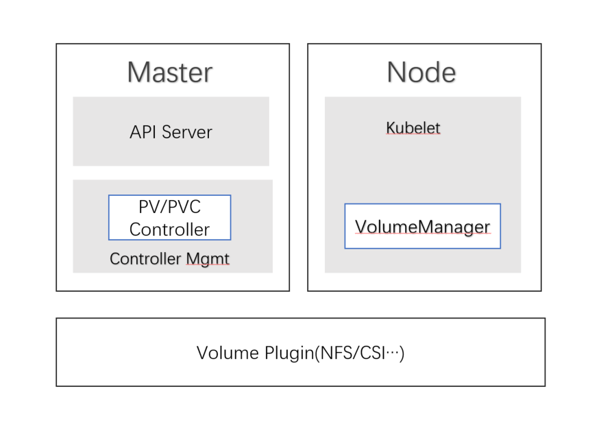

# Overview

# 背景知识

## attach

attach是将存储磁盘挂载到节点node上，这个操作可以通过PVC Controller或者kubelet来完成，大家都可以理解attach volume通过kubelet来完成，为什么需要PVC Controller的接入呢？如果当节点不稳定甚至是崩溃状态的时候，Pod是被重新调度到其他可以用的节点，而被attach到该节点的volume资源应该被释放。

此外，在现有的设计中，Kubelet中决定是否应该attach卷的循环(pod创建循环)与决定是否应该deattach卷的循环(孤立卷循环)是分开的，并且完全独立(在一个单独的线程上)。当pod在连接和分离之间快速创建、删除和重新创建时，这会导致竞争条件，从而导致不可预测的行为。

因此我们需要一个完全独立于node节点生命周期的controller来负责attach/deattach volume。 也就是我们看到的PVC Controller，它会监听来自API Server的消息，当一个新的pod被调度的时候，会触发pvc controller的attach 逻辑，当一个pod被terminate的时候，同样会触发deattach逻辑。

具体可以看 [pvc延迟绑定](/应用篇/pvc延迟绑定.md) 有描述


## 临时卷 

https://kubernetes.io/zh/docs/concepts/storage/ephemeral-volumes/

临时卷是一个存储，但不关心数据在重启之后是否可用，因此此类卷跟Pod的生命周期挂钩，跟Pod一起创建和删除。临时卷也可以设置request和limit的资源约束，如下所示

- `spec.containers[].resources.limits.ephemeral-storage`
- `spec.containers[].resources.requests.ephemeral-storage`

临时卷有几种类型：

- [emptyDir](https://kubernetes.io/zh/docs/concepts/storage/volumes/#emptydir)： Pod 启动时为空，存储空间来自本地的 kubelet 根目录（通常是根磁盘）或内存
- [configMap](https://kubernetes.io/zh/docs/concepts/storage/volumes/#configmap)、 [downwardAPI](https://kubernetes.io/zh/docs/concepts/storage/volumes/#downwardapi)、 [secret](https://kubernetes.io/zh/docs/concepts/storage/volumes/#secret)： 将不同类型的 Kubernetes 数据注入到 Pod 中
- [CSI 临时卷](https://kubernetes.io/zh/docs/concepts/storage/volumes/#csi-ephemeral-volumes)： 类似于前面的卷类型，但由专门[支持此特性](https://kubernetes-csi.github.io/docs/drivers.html) 的指定 [CSI 驱动程序](https://github.com/container-storage-interface/spec/blob/master/spec.md)提供
- [通用临时卷](https://kubernetes.io/zh/docs/concepts/storage/ephemeral-volumes/#generic-ephemeral-volumes)： 它可以由所有支持持久卷的存储驱动程序提供

## 访问模式ToBeUpdate


## 挂载

针对PV卷来说，卷是分成两种形式挂载：（默认卷的模式是Filesystem）

1. Filesystem volumeMode
2. 'Block' volumeMode

怎么理解这两种挂载模式呢，我们查看一个卷的Spec. 当Volume.Spec.volumeMode的值是`"Block"` ，就说明这个是一个'Block' volumeMode，以下的例子说明是Filesystem volumeMode

```yaml
apiVersion: v1
kind: PersistentVolume
metadata:  
  name: xx-pv
spec:
  accessModes:
  - ReadWriteMany
  capacity:
    storage: 1Gi
  nfs:
    path: /xx
    server: sxxx
  persistentVolumeReclaimPolicy: Retain
  volumeMode: Filesystem
```

接下来我们创建一个pod来挂载这个PV

```bash
kubectl apply -f - <<EOF
kind: PersistentVolumeClaim
apiVersion: v1
metadata:
  name: pvc1
spec:
  accessModes:
  - ReadWriteMany
  resources:
    requests:
      storage: 1Gi
EOF
kubectl apply -f - <<EOF
apiVersion: v1
kind: Pod
metadata:
  name: busybox1
spec:
  volumes:
    - name: pvc1
      persistentVolumeClaim:
        claimName: pvc1
  containers:
    - name: busybox
      image: busybox
      command:
        - sleep
        - "36000000"
      volumeMounts:
        - mountPath: "/pod/data"
          name: pvc1
EOF
```

然后我们去到busybox1被调度的节点上查询，可以看到该PV卷被挂载到Pod上。 `volumeMode` 属性设置为 `Filesystem` 的卷会被 Pod *挂载（Mount）* 到某个目录，Kuberneretes 会在第一次挂载卷之前 在设备上创建文件系统。

```bash
ls /var/lib/kubelet/pods/88364352-7a46-4397-8743-dcff5cf5068d/volumes/kubernetes.io~nfs/xx-pv/
```


接下来我们看看卷被作为'Block' volumeMode来挂载，同样我们创建Pod去消耗这个卷，只有spec.volumeMode改变，其他内容均不变， 但发现NFS类型无法创建block volumeMode，查询官网https://kubernetes.io/zh/docs/concepts/storage/persistent-volumes/#raw-block-volume-support 后发现NFS是不支持block VolumeMode，于是乎改CSI类型的PV。

发现如果我们使用`Block`类型的volumeMode，在节点上

```yaml


```


# desiredStateOfWorld

`DesiredStateOfWorld` 为kubelet卷管理所需的**缓存状态**定义一组线程安全的操作。里面的每一个volume都会保存着该Volume会被attach到哪个节点信息，以及pod的信息。VolumeManager模块会负责从API Server里面获取所有的PV对象信息填充Volume和Node， Pod的信息到缓存里面。

我们看看`DesiredStateOfWorld`  的数据结构定义和接口：

```go
// 代码位置 pkg/kubelet/volumemanager/cache/desired_state_of_world.go
type desiredStateOfWorld struct {	
    // volumesToMount 是一个map, key是volume的name, 值是volumeToMount。 该map指出volumes应该被attach到哪个节点并且挂载到指定的pod。 volumeToMount是一个保存包含volumename, podsToMount,pluginIsAttachable等的数据结构
	volumesToMount map[v1.UniqueVolumeName]volumeToMount	
    // volumePluginMgr对象，用来创建volume plugin的对象
	volumePluginMgr *volume.VolumePluginMgr
	podErrors map[types.UniquePodName]sets.String

	sync.RWMutex
}

type DesiredStateOfWorld interface {
	// AddPodToVolume 是在缓存里面告诉pod应该挂载哪个volume
	AddPodToVolume(podName types.UniquePodName, pod *v1.Pod, volumeSpec *volume.Spec, outerVolumeSpecName string, volumeGidValue string) (v1.UniqueVolumeName, error)

	MarkVolumesReportedInUse(reportedVolumes []v1.UniqueVolumeName)

	DeletePodFromVolume(podName types.UniquePodName, volumeName v1.UniqueVolumeName)

	VolumeExists(volumeName v1.UniqueVolumeName) bool

	PodExistsInVolume(podName types.UniquePodName, volumeName v1.UniqueVolumeName) bool

	GetVolumesToMount() []VolumeToMount

	GetPods() map[types.UniquePodName]bool

	VolumeExistsWithSpecName(podName types.UniquePodName, volumeSpecName string) bool

	AddErrorToPod(podName types.UniquePodName, err string)

	PopPodErrors(podName types.UniquePodName) []string

	GetPodsWithErrors() []types.UniquePodName
}
```


```go
func (dsw *desiredStateOfWorld) AddPodToVolume(
	podName types.UniquePodName,
	pod *v1.Pod,
	volumeSpec *volume.Spec,
	outerVolumeSpecName string,
	volumeGidValue string) (v1.UniqueVolumeName, error) {

	// FindPluginBySpec 是通过获取volume的spec，然后轮询调用每一个Volume插件的CanSupport方法，例如NFS插件是通过比较spec.PersistentVolume.Spec.NFS != nil来返回结果，true说明该插件支持，如果支持volume.spec的插件超过1个，则返回nil，如果刚好只有一个插件支持那么返回该插件
	volumePlugin, err := dsw.volumePluginMgr.FindPluginBySpec(volumeSpec)
	
	var volumeName v1.UniqueVolumeName
	
    // 这个很有意思，因为不是每一个卷都需要attach/deatch，例如localpath是不需要attach的，但每一个volume都需要挂载和卸载，因此这个函数是通过volumeSpec来查找一个可以attach的插件，会调用volume插件的CanAttach方法来判断插件是否支持attach，如果支持会调用插件的NewAttacher方法
	attachable := dsw.isAttachableVolume(volumeSpec)
    // 同样的，调用volume plugin的CanDeviceMount方法来判断插件是否支持挂载, 如果支持会调用插件的NewDeviceMounter方法
	deviceMountable := dsw.isDeviceMountableVolume(volumeSpec)
    // 对于可以attach或者挂载的卷，会使用volumePlugi生成一个唯一的名字
	if attachable || deviceMountable {		
		volumeName, err =
			util.GetUniqueVolumeNameFromSpec(volumePlugin, volumeSpec)
		if err != nil {
			return "", fmt.Errorf(...)
		}
	} else {		
        // 对于不可attach和不可挂载的卷，基于pod来生成一个唯一的name
		volumeName = util.GetUniqueVolumeNameFromSpecWithPod(podName, volumePlugin, volumeSpec)
	}	
	if _, volumeExists := dsw.volumesToMount[volumeName]; !volumeExists {
		var sizeLimit *resource.Quantity
		if volumeSpec.Volume != nil {
            // 如果是一个临时的卷（通过检查volume.EmptyDir是否为空和volume.EmptyDir.Medium是否等于"memroy"或者volume的GitRepo为空来决定这个是否是临时卷），那么就为他设置资源约束
			if util.IsLocalEphemeralVolume(*volumeSpec.Volume) {
				_, podLimits := apiv1resource.PodRequestsAndLimits(pod)
				ephemeralStorageLimit := podLimits[v1.ResourceEphemeralStorage]
				sizeLimit = resource.NewQuantity(ephemeralStorageLimit.Value(), resource.BinarySI)
				if volumeSpec.Volume.EmptyDir != nil &&
					volumeSpec.Volume.EmptyDir.SizeLimit != nil &&
					volumeSpec.Volume.EmptyDir.SizeLimit.Value() > 0 &&
					volumeSpec.Volume.EmptyDir.SizeLimit.Value() < sizeLimit.Value() {
					sizeLimit = resource.NewQuantity(volumeSpec.Volume.EmptyDir.SizeLimit.Value(), resource.BinarySI)
				}
			}
		}
        // 设置map里面volumeToMount的值
		dsw.volumesToMount[volumeName] = volumeToMount{
			volumeName:              volumeName,
			podsToMount:             make(map[types.UniquePodName]podToMount),
			pluginIsAttachable:      attachable,
			pluginIsDeviceMountable: deviceMountable,
			volumeGidValue:          volumeGidValue,
			reportedInUse:           false,
			desiredSizeLimit:        sizeLimit,
		}
	}

    // 初始化podToMount，如果已经存在则更新里面的值
	dsw.volumesToMount[volumeName].podsToMount[podName] = podToMount{
		podName:             podName,
		pod:                 pod,
		volumeSpec:          volumeSpec,
		outerVolumeSpecName: outerVolumeSpecName,
	}
	return volumeName, nil
}
```


这里给一个CSI 插件的PV的例子：

首先volume manager会调用`spec.PersistentVolume.Spec.CSI` 是否为空来判断这个Volume是否是CSI， 

而CSI插件实现了`CanAttach` 和`CanDeviceMount` ，因此也同时调用了插件的`NewAttacher`和`NewDeviceMounter` 实例化

然后csi 通过`GetVolumeName`来生成唯一的名字：`fmt.Sprintf("%s%s%s", csi.Driver, volNameSep, csi.VolumeHandle)` 也就是hostpath.csi.k8s.io^c8ebeba1-xx

因为我们这个例子里面并不是用到临时卷，因此设置缓存里面volumesToMount[volumeName]的值以及 返回volumeName即可

```yaml
apiVersion: v1
kind: PersistentVolume
metadata:
  annotations:
    pv.kubernetes.io/provisioned-by: hostpath.csi.k8s.io
  ...  
spec:
  accessModes:
  - ReadWriteOnce
  capacity:
    storage: 1Gi
  claimRef:
    apiVersion: v1
    kind: PersistentVolumeClaim
    name: csi-pvc
    namespace: default
    resourceVersion: "199571261"
    uid: c2160217-xx
  csi:
    driver: hostpath.csi.k8s.io
    volumeAttributes:
      storage.kubernetes.io/csiProvisionerIdentity: 1612871894385-8081-hostpath.csi.k8s.io
    volumeHandle: c8ebeba1-xx
  ...
```


# desiredStateOfWorldPopulator

`DesiredStateOfWorldPopulator`**定期**循环遍历action的pod列表，并确保每个pod都存在于desire state of world缓存的所需状态(如果它有卷的话)。它还验证处于desire状态的world缓存中的pods是否仍然存在，如果不存在，则删除它们。

我们来看看`DesiredStateOfWorldPopulator`的Run的工作流程：

1. 从actualStateOfWorld里面获取Volumes
2. 从podManager中获取所有的非terminate的pods，轮询这里的所有pods做出以下操作：
   1. 获取该Pod用到的所有Container里面的container.VolumeMount和container.VolumeDevices
   2. 轮询该pod的所有pod.Spec.Volumes， 如果container.VolumeMount里面不包含pod.spec.Volumes.Name，就认为这个volume不是pod所需要的，就跳过，除此之外的所有Spec.Volumes, 就添加到desiredStateOfWorld（通过调用desiredStateOfWorld.AddPodToVolume）。 
3. 计算从上次获取pod状态的实际到现在的持续时间，如果少于`getPodStatusRetryDuration`的时间，就认为可以不调用`findAndRemoveDeletedPods`， 直接返回完成这次调用。 否则，就要调用`findAndRemoveDeletedPods` 

```go
// 代码位置 pkg/kubelet/volumemanager/populator/desired_state_of_world_populator.go
func (dswp *desiredStateOfWorldPopulator) Run(sourcesReady config.SourcesReady, stopCh <-chan struct{}) {
    ...
    // 定期运行populatorLoop
	wait.Until(dswp.populatorLoop, dswp.loopSleepDuration, stopCh)
}

func (dswp *desiredStateOfWorldPopulator) populatorLoop() {
    // 从actualStateOfWorld里面获取Volumes ，从podManager中获取所有的非terminate的pods， 对于没有Volume应该attach和mount到Pod的列表（其实是对比container跟pod的volume是否都被挂载到container上），就调用processPodVolumes 把他们加到Disred state of world的缓存里面
	dswp.findAndAddNewPods()

	// 计算从上次获取pod状态的实际到现在的持续时间，如果少于`getPodStatusRetryDuration`的时间，就认为可以不调用`findAndRemoveDeletedPods`， 直接返回完成这次调用。 否则，就要调用`findAndRemoveDeletedPods` 
	if time.Since(dswp.timeOfLastGetPodStatus) < dswp.getPodStatusRetryDuration {		
		return
	}

	dswp.findAndRemoveDeletedPods()
}

```

以下是一个例子去解析`DesiredStateOfWorldPopulator`的工作流程，他首先从kubelet的podManager模块中获取所有Not terminate的Pod, (podManager模块是记录着节点里面的所有pod)，假设以下的Pod是从podManager模块中获取出来，

1. 查询Container里面的container.VolumeMount添加到切片中， 这里就是[]string{'socket-dir', 'csi-attacher-token-l6cr2'}，
2. 轮询该pod的所有pod.Spec.Volumes，这里就是[]string{'socket-dir', 'csi-attacher-token-l6cr2'}

```yaml
apiVersion: v1
kind: Pod
metadata:  
  labels:
    app: csi-hostpath-attacher
    controller-revision-hash: csi-hostpath-attacher-6fb7c87f54
    statefulset.kubernetes.io/pod-name: csi-hostpath-attacher-0
... 
spec: 
  containers:
    name: csi-attacher
    volumeMounts:
    - mountPath: /csi
      name: socket-dir
    - mountPath: /var/run/secrets/kubernetes.io/serviceaccount
      name: csi-attacher-token-l6cr2
      readOnly: true
  volumes:
  - hostPath:
      path: /var/lib/kubelet/plugins/csi-hostpath
      type: DirectoryOrCreate
    name: socket-dir
  - name: csi-attacher-token-l6cr2
    secret:
      defaultMode: 420
      secretName: csi-attacher-token-l6cr2
...
```


# Reconciler

`Reconciler`是一个定期的运行方法，通过触发attach、detach、mount和unmount操作来协调desire state和actual state。

注意:这与attach/detach控制器实现的reconciler不同。这调和了kubelet卷管理器的状态。这将协调attach/detach控制器的状态。

`Reconciler` 定期运行以下流程：

1. 从desiredStateOfWorld缓存中获取所有已经挂载的卷， 保证所有需要被unmount的卷都是unmount的状态
   1. 轮询所有volume, 检查该volume是否在desiredstateofWorld里面有pod需要挂载这个volume，如果不需要的话执行unmount
2. 从desiredStateOfWorld缓存中获取所有需要挂载的volumens，保证需要被挂载的volume被mount
   1. 首先调用PodExistsInVolume检查卷是否被attach到节点上并且pod是挂载了该卷：
      1. 如果返回的错误是volumeNotAttachedError
         1. 这里首先会检查是否让pvc controller来负责attachdetach操作或者被执行的卷使用的插件是否支持attach，如果不是，则调用operationexecutor来把volume attach到节点上。
      2. 如果卷没有被挂载并且返回错误是remountRequiredError，那么执行挂载操作
      3. 如果错误是fsResizeRequiredError， 那么执行扩容
3. 从actualStateOfWorld缓存中获取所有需要detach或者卸载的卷，执行detach/unmount操作

```go
// 代码位置 pkg/kubelet/volumemanager/reconciler/reconciler.go
func (rc *reconciler) Run(stopCh <-chan struct{}) {
    // 定时运行reconciliationLoopFunc()
	wait.Until(rc.reconciliationLoopFunc(), rc.loopSleepDuration, stopCh)
}
```

然后从调用链关系，`reconciliationLoopFunc()` 调用了`reconcile()`

```go
// 代码位置 pkg/kubelet/volumemanager/reconciler/reconciler.go
func (rc *reconciler) reconcile() {
	// 从desiredStateOfWorld缓存中获取所有已经挂载的卷， 保证所有需要被unmount的卷都是unmount的状态
	for _, mountedVolume := range rc.actualStateOfWorld.GetMountedVolumes() {
        // 检查该volume是否在desiredstateofWorld里面有pod需要挂载这个volume，如果不需要的话执行以下逻辑
		if !rc.desiredStateOfWorld.PodExistsInVolume(mountedVolume.PodName, mountedVolume.VolumeName) {
            //  执行unmount
			err := rc.operationExecutor.UnmountVolume(
				mountedVolume.MountedVolume, rc.actualStateOfWorld, rc.kubeletPodsDir)					
		}
	}

    // 从desiredStateOfWorld缓存中获取所有需要attach/挂载的volumens，保证需要被挂载的volume被attach/mount
	for _, volumeToMount := range rc.desiredStateOfWorld.GetVolumesToMount() {        
        // PodExistsInVolume是检查卷是否被attach到节点上并且pod是挂载了该卷
		volMounted, devicePath, err := rc.actualStateOfWorld.PodExistsInVolume(volumeToMount.PodName, volumeToMount.VolumeName)
		volumeToMount.DevicePath = devicePath
        // 如果返回错误是属于volumeNotAttachedError
		if cache.IsVolumeNotAttachedError(err) {
			...
        // 如果卷没有被挂载并且返回错误是remountRequiredError，那么执行挂载操作
		} else if !volMounted || cache.IsRemountRequiredError(err) {
			...
        // 如果错误是fsResizeRequiredError， 那么执行扩容
		} else if cache.IsFSResizeRequiredError(err) &&
			utilfeature.DefaultFeatureGate.Enabled(features.ExpandInUsePersistentVolumes) {
			...
		}
	}
	
    // 从actualStateOfWorld缓存中获取应该要被detached/unmounted的卷，执行detached/unmounted
	for _, attachedVolume := range rc.actualStateOfWorld.GetUnmountedVolumes() {
		...
	}
}
```

## OperationExecutor

OperationExecutor定义了一组用于挂载、卸载、挂载或卸载卷的操作的接口，这些操作通过一个新的nestedpendingoperations执行，以防止在同一个卷上触发多个操作。

这些操作应该是幂等的(例如，如果卷已经挂接到节点上，AttachVolume仍然会成功，等等)。然而，它们依赖于volume插件来实现这种行为。

 一旦操作成功完成，actualStateOfWorld就会更新，以指示卷已挂载/卸载/挂载/卸载。

如果OperationExecutor无法启动操作，例如，一个具有相同UniqueVolumeName的操作已经挂起，那么将返回一个非nil错误。

一旦操作启动，因为它是**异步**执行的，错误被简单地记录下来，goroutine被终止，而不需要更新actualStateOfWorld(调用方负责根据需要进行重试)。

其中一些操作可能会导致对API服务器的调用;呼叫者负责错误的速率限制。

```go
// 代码位置 pkg/volume/util/operationexecutor/operation_executor.go
type OperationExecutor interface {
	// 把卷挂载到节点上，并且更新ActualStateOfWorld
	AttachVolume(volumeToAttach VolumeToAttach, actualStateOfWorld ActualStateOfWorldAttacherUpdater) error

	// VerifyVolumesAreAttachedPerNode验证给定的卷列表，以查看它们是否仍然连接到节点。如果现在没有任何卷，它将更新ActualStateOfWorld。
	VerifyVolumesAreAttachedPerNode(AttachedVolumes []AttachedVolume, nodeName types.NodeName, actualStateOfWorld ActualStateOfWorldAttacherUpdater) error

	// VerifyVolumesAreAttached验证在整个集群中使用的卷，以及它们是否仍然连接到节点上。 如果任何卷现在没有附加，它将更新ActualStateOfWorld。
	VerifyVolumesAreAttached(volumesToVerify map[types.NodeName][]AttachedVolume, actualStateOfWorld ActualStateOfWorldAttacherUpdater)

	// DetachVolume从volumeToDetach中指定的节点上卸载卷，并更新ActualStateOfWorld。如果设置了verifySafeToDetach，将调用获取节点对象，并使用它来验证卷在节点状态下不存在
	DetachVolume(volumeToDetach AttachedVolume, verifySafeToDetach bool, actualStateOfWorld ActualStateOfWorldAttacherUpdater) error

	// 如果一个卷有Filesystem volumeMode, MountVolume将该卷挂载到volumeToMount中指定的pod上。具体来说，
    // 1. 它将:*等待设备完成挂载(仅用于可挂载的卷)。
    // 2. *将设备挂载到全局挂载路径(仅用于可挂载的卷)。
    // 3. *更新ActualStateOfWorld，以反映卷是全局挂载的(仅用于可挂载的卷)。
    // 4. *将卷挂载到pod指定的路径上。
    // 5. *更新ActualStateOfWorld，以反映卷已挂载到pod路径。参数“isRemount”是一种信息，用于调整日志记录的详细程度。例如，初始挂载比重新挂载更有记录价值。
    // 对于'Block' volumeMode，这个方法从volumeToMount中指定的pod和全局映射路径创建到卷的符号链接。具体来说，它将:*等待设备完成挂载(仅用于可挂载的卷)。*更新ActualStateOfWorld，。使用符号链接将卷映射到全局映射路径。*使用符号链接将卷映射到pod设备映射路径。*更新ActualStateOfWorld，以反映卷是挂载/映射到pod路径。
	MountVolume(waitForAttachTimeout time.Duration, volumeToMount VolumeToMount, actualStateOfWorld ActualStateOfWorldMounterUpdater, isRemount bool) error

	// 如果一个卷具有'Filesystem' volumeMode，那么UnmountVolume从volumeounmount中指定的pod中卸载该卷，并更新ActualStateOfWorld。
	// 对于'Block' volumeMode，该方法将符号链接从volumeounmount中的pod设备映射路径和全局映射路径解映射到卷。然后，更新世界的实际状态来反映这一点。
	UnmountVolume(volumeToUnmount MountedVolume, actualStateOfWorld ActualStateOfWorldMounterUpdater, podsDir string) error	
	...
}
```


```go
err := rc.operationExecutor.AttachVolume(volumeToAttach, rc.actualStateOfWorld)

err := rc.operationExecutor.MountVolume(
				rc.waitForAttachTimeout,
				volumeToMount.VolumeToMount,
				rc.actualStateOfWorld,
				isRemount)
```


### AttachVolume

Attach是卷的一个interface，并不是所有的卷都支持Attach, 例如NFS就不支持Attach,  如果实现了`NewAttacher`方法的卷的插件，就说明支持Attach， 当然我们也可以使用`CanAttach`来测试一个卷插件是否支持Attach.

```go
// 代码位置 pkg/volume/plugins.go
type AttachableVolumePlugin interface {
	DeviceMountableVolumePlugin
	NewAttacher() (Attacher, error)
	NewDetacher() (Detacher, error)	
	CanAttach(spec *Spec) (bool, error)
}
```

我们从上面的`Reconciler`可以看到， 定时会执行从desiredStateOfWorld缓存中获取所有需要挂载的volumens，保证需要被挂载的volume被mount，会先调用PodExistsInVolume检查卷是否被attach到节点上并且pod是挂载了该卷。然后触发了`AttachVolume()`,  会具体根据Volume.Spec查询是使用了哪个volume plugin, 然后再调用具体插件的的`NewAttacher()`方法以及执行`Attach`将卷attach到节点上，再更新ActualStateOfWorld缓存。

```go
// 代码位置 pkg/volume/util/operationexecutor/operation_executor.go
func (oe *operationExecutor) AttachVolume(
	volumeToAttach VolumeToAttach,
	actualStateOfWorld ActualStateOfWorldAttacherUpdater) error {
	generatedOperations :=
		oe.operationGenerator.GenerateAttachVolumeFunc(volumeToAttach, actualStateOfWorld)

	return oe.pendingOperations.Run(
		volumeToAttach.VolumeName, "" /* podName */, generatedOperations)
}

// 代码位置 pkg/volume/util/operationexecutor/operation_generator.go
func (og *operationGenerator) GenerateAttachVolumeFunc(
	volumeToAttach VolumeToAttach,
	actualStateOfWorld ActualStateOfWorldAttacherUpdater) volumetypes.GeneratedOperations {

	attachVolumeFunc := func() (error, error) {
        // 获取volume plugin
		attachableVolumePlugin, err :=
			og.volumePluginMgr.FindAttachablePluginBySpec(volumeToAttach.VolumeSpec)
		...
		}
    	// 调用volume plugin的NewAttacher()方法
		volumeAttacher, newAttacherErr := attachableVolumePlugin.NewAttacher()
		..
		}

		// 调用volume plugin自己对应的 Attach方法去获取设备目录
		devicePath, attachErr := volumeAttacher.Attach(
			volumeToAttach.VolumeSpec, volumeToAttach.NodeName)
		...		
		// 更新ActualStateOfWorld
		addVolumeNodeErr := actualStateOfWorld.MarkVolumeAsAttached(
			v1.UniqueVolumeName(""), volumeToAttach.VolumeSpec, volumeToAttach.NodeName, devicePath)		
		...
		return nil, nil
	}
	
	return volumetypes.GeneratedOperations{
		OperationName:     "volume_attach",
		OperationFunc:     attachVolumeFunc,
		EventRecorderFunc: eventRecorderFunc,
		CompleteFunc:      util.OperationCompleteHook(util.GetFullQualifiedPluginNameForVolume(attachableVolumePluginName, volumeToAttach.VolumeSpec), "volume_attach"),
	}
}
```


### MountVolume

工作流程如下：

1. 通过查询spec.VolumeMode来检查卷是属于什么模式，是文件系统模式还是块设备模式
2. 如果是文件系统模式挂载的卷:
   1.  它将:*等待设备完成挂载(仅用于可挂载的卷)。*
   2. 将设备挂载到全局挂载路径(仅用于可挂载的卷)。
   3. 更新ActualStateOfWorld，以反映卷是全局挂载的(仅用于可挂载的卷)
   4. 将卷挂载到pod指定的路径上。
   5. 更新ActualStateOfWorld，
3. 如果是块设备模式的卷，创建一个符号链接文件，通过这个文件将设备映射到 Pod 内部。
   1. 它将:*等待设备完成挂载(仅用于可挂载的卷)。*
   2. 更新ActualStateOfWorld
   3. 使用符号链接将卷映射到全局映射路径。
   4. 使用符号链接将卷映射到pod设备映射路径。
   5. 更新ActualStateOfWorld，以反映卷是挂载/映射到pod路径。
4. Run将volumeName和podName的连接添加到正在运行的操作列表中，并生成一个新的go携程来执行operationFunc

```go
//代码位置 pkg/volume/util/operationexecutor/operation_executor.go
func (oe *operationExecutor) MountVolume(
	waitForAttachTimeout time.Duration,
	volumeToMount VolumeToMount,
	actualStateOfWorld ActualStateOfWorldMounterUpdater,
	isRemount bool) error {
    // 首先通过查询VolumeSpec来检查卷是属于什么模式，是文件系统模式还是块设备模式
	fsVolume, err := util.CheckVolumeModeFilesystem(volumeToMount.VolumeSpec)
	
	var generatedOperations volumetypes.GeneratedOperations
	if fsVolume {
		generatedOperations = oe.operationGenerator.GenerateMountVolumeFunc(
			waitForAttachTimeout, volumeToMount, actualStateOfWorld, isRemount)

	} else {
        // 如果是块设备模式的卷，创建一个符号链接文件，通过这个文件将设备映射到 Pod 内部。
		generatedOperations, err = oe.operationGenerator.GenerateMapVolumeFunc(
			waitForAttachTimeout, volumeToMount, actualStateOfWorld)
	}
	
	...
	// Run将volumeName和podName的连接添加到正在运行的操作列表中，并生成一个新的go携程来执行operationFunc
	return oe.pendingOperations.Run(
		volumeToMount.VolumeName, podName, generatedOperations)
}

```


# Run

在Kubelet自身服务的启动的时候，会开启一个go协程通过`volumeManager.Run` 来启动`volumeManager`。

Attach或者挂载Volume是需要一定时间， 在K8S中，会设计一套缓存，让这套缓存去保存卷的期望状态和真实状态，然后使用reconciler去调和，让需要被挂载的卷执行挂载，需要被卸载的卷执行卸载。

```go
// 代码位置 pkg/kubelet/kubelet.go
func (kl *Kubelet) Run(updates <-chan kubetypes.PodUpdate) {
	...
	// Start volume manager
	go kl.volumeManager.Run(kl.sourcesReady, wait.NeverStop)
}
```

`VolumeManager` 这个模块实际上工作流程很简单：

1. 开启一个协程运行`desiredStateOfWorldPopulator`。
   1. 而`DesiredStateOfWorldPopulator.Run`会**定期**循环遍历action的pod列表，并确保每个pod都存在于desire state of world缓存的所需状态(如果它有卷的话)
2. 开启一个协程运行`reconciler`
   1. `Reconciler.Run`也是一个定期的运行方法，通过触发attach、detach、mount和unmount操作来协调desire state和actual state。
3. 通过检查kubeClient是否为nil ， 如果为空，则执行`vm.volumePluginMgr.Run()` 来启动CSIDriver的informer

```go
// 代码位置 pkg/kubelet/volumemanager/volume_manager.go
func (vm *volumeManager) Run(sourcesReady config.SourcesReady, stopCh <-chan struct{}) {
	go vm.desiredStateOfWorldPopulator.Run(sourcesReady, stopCh)
	klog.V(2).Infof("The desired_state_of_world populator starts")

	klog.Infof("Starting Kubelet Volume Manager")
	go vm.reconciler.Run(stopCh)

	if vm.kubeClient != nil {
		vm.volumePluginMgr.Run(stopCh)
	}
	<-stopCh
	klog.Infof("Shutting down Kubelet Volume Manager")
}
```


# 总结

整个VolumeManager实际上是从PodManager中获取所有Pod, 以及对应的PV/PVC， 分析该Pod是需要Attach 或者是Detach ， Mount 或者Unmount Volume的操作写入desire state，由于Volume的Attach/Mount之类的操作需要一定的时间，K8S是需要维护一套缓存，存储了卷的预期状态desire state和实际状态actual state， 通过触发操作，来更新actual state。




# Reference

https://github.com/kubernetes/kubernetes/issues/20262