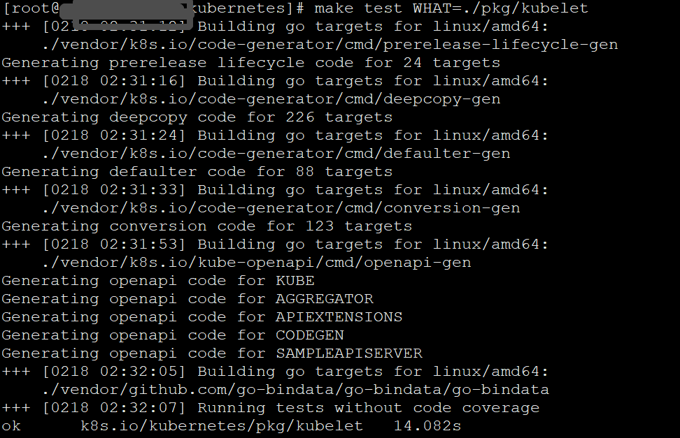

# Overview

此篇文档主要是讲kubelet的测试，包括单元测试，功能测试。

# 单元测试

只测试`pkg/kubelet`

```bash
make test WHAT=./pkg/kubelet 
```




测试kubelet以及它的所有subpackages

```bash
make test WHAT=./pkg/kubelet/..
```


单元测试的覆盖率

```bash
make test WHAT=./pkg/kubelet KUBE_COVER=y
```


只运行某个单元测试函数

```bash
make test WHAT=./pkg/kubelet GOFLAGS="-v" KUBE_TEST_ARGS='-run TestSyncPodsDeletesWhenSourcesAreReady'
# 以下是输出
+++ [0218 04:26:52] Running tests without code coverage
=== RUN   TestSyncPodsDeletesWhenSourcesAreReadyPerQOS
W0218 04:27:01.705184   25186 mutation_detector.go:53] Mutation detector is enabled, this will result in memory leakage.
W0218 04:27:03.706031   25186 kubelet_getters.go:311] Path "/tmp/kubelet_test.502019488/pods/12345678/volumes" does not exist
W0218 04:27:03.706145   25186 kubelet_getters.go:311] Path "/tmp/kubelet_test.502019488/pods/12345678/volumes" does not exist
W0218 04:27:03.706195   25186 kubelet_getters.go:311] Path "/tmp/kubelet_test.502019488/pods/12345678/volumes" does not exist
--- PASS: TestSyncPodsDeletesWhenSourcesAreReadyPerQOS (4.10s)
=== RUN   TestSyncPodsDeletesWhenSourcesAreReady
W0218 04:27:05.807885   25186 mutation_detector.go:53] Mutation detector is enabled, this will result in memory leakage.
--- PASS: TestSyncPodsDeletesWhenSourcesAreReady (0.00s)
PASS
ok  	k8s.io/kubernetes/pkg/kubelet	4.173
```

并行3个Workers运行6单元测试（也就是18次，重复运行某个测试有时候可以发现问题）

```bash
make test WHAT=./pkg/kubelet  PARALLEL=3 ITERATION=6
```


# 功能测试