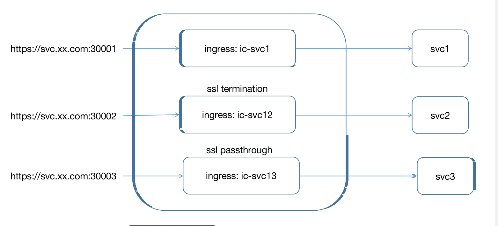

# why this document
刚好同事问了一下一个ingress-controller 能否同时支持ssl-termination 跟 ssl passthrough
这个文档针对这个问题来写

# 模型
传统安全通信模型（在负载均衡/反向代理入口做加密通信）：
client --- (via https) ---> nginx ---- (via http) ----> upstream backend services
更为安全的通信模型：
client --- (via https) ---> nginx ---- (via https) ----> upstream backend services

# 例子

说明：
svc1: 是对传统通信模型的“复现”，即client与ingress controller(nginx)间采用https加密通信，但ingress controller(nginx)与svc1间则是明文的http通信；

svc2: 是ssl-termination的安全配置模型，即client与svc2的https通信分为“两段”，client与nginx建立https连接后，nginx将client提交的加密请求解密后，再向svc2发起https请求，并重新加密请求数据。这种client端ssl的过程在反向代理或负载均衡器终结的https通信方式被称为“ssl-termination”。

svc3: 是ssl-passthrough的安全配置模型，即nginx不会对client的https request进行解密，而是直接转发给backend的svc3服务，client端的ssl过程不会终结于nginx，而是在svc3对应的pod中终结。这种https通信方式被称为”ssl-passthrough”。这种配置模型尤其适合backend service对client端进行client certificate验证的情况，同时也降低了nginx加解密的性能负担


# 环境搭建
安装inc
```bash
helm install ingress-nginx -n kube-system https://github.com/kubernetes/ingress-nginx/releases/download/helm-chart-4.11.3/ingress-nginx-4.11.3.tgz
```

## ssl-termination, 但nginx与backend服务之间采用明文传输（http)
加密Web流量有两个主要配置方案：SSL termination和SSL passthrough。

使用SSL termination时，客户端的SSL请求在负载均衡器/反向代理中解密，解密操作将增加负载均衡器的工作负担，较为耗费CPU，但简化了SSL证书的管理。至于负载均衡器和后端之间的流量是否加密，需要nginx另行配置。

SSL Passthrough，意味着client端将直接将SSL连接发送到后端(backend)。与SSL termination不同，请求始终保持加密，并且解密负载分布在后端服务器上。但是，这种情况的SSL证书管理略复杂，证书必须在每台服务器上自行管理。另外，在这种方式下可能无法添加或修改HTTP header，可能会丢失X-forwarded-* header中包含的客户端的IP地址，端口和其他信息。

我们先来看一种并不那么“安全”的“传统模型”：在nginx上暴露https，但nginx到backend service(svc1)采用http。

我们先来创建相关的密钥和公钥证书，并以一个Secret：demo-tls-secret存储秘密

```bash
openssl req -x509 -nodes -days 365 -newkey rsa:2048 -keyout ic1.key -out ic1.crt -subj "/CN=*.example.com/O=example.com"
kubectl create secret tls ingress-controller-demo-tls-secret --key  ic1.key --cert ic1.crt
```

我们开启了tls，secret用的就是我们上面创建的那个secret：ingress-controller-demo-tls-secret。


```yaml
---
apiVersion: v1
kind: Service
metadata:
  name: ic1-svc1
  labels:
    app: svc1
spec:
  type: ClusterIP
  ports:
    - port: 443
      targetPort: http
      protocol: TCP
      name: http
  selector:
    app: svc1
    release: ic1
---
apiVersion: apps/v1
kind: Deployment
metadata:
  name: ic1-svc1
  labels:
    app: svc1
spec:
  replicas: 1
  selector:
    matchLabels:
      app: svc1
      release: ic1
  template:
    metadata:
      labels:
        app: svc1
        release: ic1
    spec:
      containers:
        - name: svc1
          image: "nginx:1.14.2"
          imagePullPolicy: Always
          ports:
            - name: http
              containerPort: 8080
              protocol: TCP
          resources:
            {}
---
apiVersion: networking.k8s.io/v1 
kind: Ingress
metadata:
  name: ic1-svc1
  labels:
    app: svc1
  annotations:
    kubernetes.io/ingress.class: nginx
spec:
  tls:
    - hosts:
        - svc1.example.com
      secretName: ingress-controller-demo-tls-secret
  rules:
    - host: svc1.example.com
      http:
        paths:
        - backend:
            service:
              name: ic1-svc1
              port:
                number: 80
          path: /
          pathType: ImplementationSpecific
```

这个时候如果我们看nginx conf 可以看到配置如下
```
# kubectl exec nginx-ingress-controller-xx -n kube-system -- cat /etc/nginx/nginx.conf

        # map port 442 to 443 for header X-Forwarded-Port
        map $pass_server_port $pass_port {
                442              443;
                default          $pass_server_port;
        }

        upstream default-svc1-http {
                least_conn;

                keepalive 32;

                server 192.168.28.13:8080 max_fails=0 fail_timeout=0;

        }

## start server svc1.example.com
        server {
                server_name svc1.example.com ;

                listen 80;

                listen [::]:80;

                set $proxy_upstream_name "-";

                listen 442 proxy_protocol   ssl http2;

                listen [::]:442 proxy_protocol  ssl http2;

                # PEM sha: 248951b75535e0824c1a7f74dc382be3447057b7
                ssl_certificate                         /ingress-controller/ssl/default-ingress-controller-demo-tls-secret.pem;
                ssl_certificate_key                     /ingress-controller/ssl/default-ingress-controller-demo-tls-secret.pem;

                ssl_trusted_certificate                 /ingress-controller/ssl/default-ingress-controller-demo-tls-secret-full-chain.pem;
                ssl_stapling                            on;
                ssl_stapling_verify                     on;

                location / {
                        ... ...
                        proxy_pass http://default-svc1-http;

                        proxy_redirect                          off;

                }
           ... ...
        }
        ## end server svc1.example.com
```

可以看到30001(nodeport) 映射的ingress controller的443端口在svc1.example.com这个server域名下已经有了ssl标识，并且ssl_certificate和ssl_certificate_key对应的值就是我们之前创建的ingress-controller-demo-tls-secret。

然后使用curl 访问svc1
```bash
curl -k https://svc1.example:30001
nginx
```

此时，如果再用http方式去访问svc1，你会得到下面错误结果：
```bash
# curl http://svc1.example.com:30092
<html>
<head><title>400 The plain HTTP request was sent to HTTPS port</title></head>
<body bgcolor="white">
<center><h1>400 Bad Request</h1></center>
<center>The plain HTTP request was sent to HTTPS port</center>
```


## svc2: 使用ssl termination，但nginx与backend服务之间采用加密传输(https)
SSL termination配置场景中，负载均衡器和后端之间的流量是否加密，需要nginx另行配置。svc1采用了未加密的方式，nginx -> backend service存在安全风险，我们要将其改造为也通过https进行数据加密传输，于是有了svc2这个例子。

```yaml
nginx.ingress.kubernetes.io/secure-backends: "true"
```

ingress跟上面一样，只是多了 `nginx.ingress.kubernetes.io/secure-backends: "true"·` annotations


这个annotation让nginx以https的方式去访问backend service: svc2。安装svc2 之后 nginx controller为svc2生成的配置如下：

```
## start server svc2.example.com
        server {
                server_name svc2.example.com;

                listen 80;

                listen [::]:80;

                set $proxy_upstream_name "-";

                listen 442 proxy_protocol   ssl http2;

                listen [::]:442 proxy_protocol  ssl http2;

                # PEM sha: 248951b75535e0824c1a7f74dc382be3447057b7
                ssl_certificate                         /ingress-controller/ssl/default-ingress-controller-demo-tls-secret.pem;
                ssl_certificate_key                     /ingress-controller/ssl/default-ingress-controller-demo-tls-secret.pem;

                ssl_trusted_certificate                 /ingress-controller/ssl/default-ingress-controller-demo-tls-secret-full-chain.pem;
                ssl_stapling                            on;
                ssl_stapling_verify                     on;

                location / {
                     ... ...
                        proxy_pass https://default-svc2-https;

                        proxy_redirect                          off;

                }

        }
        ## end server svc2.example.com

        upstream default-svc2-https {
                least_conn;

                keepalive 32;

                server 192.168.28.14:8080 max_fails=0 fail_timeout=0;

        }

```
## ssl-passthrough （svc3: 使用ssl passthrough, termination at pod）
某些服务需要通过对client端的证书进行校验的方式，进行身份验证和授权，svc3就是这样一个对client certification进行校验的双向https校验的service。针对这种情况，ssl termination的配置方法无法满足需求，我们需要使用ssl passthrough的方案。

在ingress nginx controller开启ssl passthrough方案需要在ingress controller和ingress中都做一些改动。

首先我们需要为nginx-ingress-controller添加一个新的命令行参数：–enable-ssl-passthrough，并重新apply生效：
```yaml
spec:
      containers:
        - name: nginx-ingress-controller
          args:
            - /nginx-ingress-controller
            - --enable-ssl-passthrough
```
然后为ingress添加新的annotation `nginx.ingress.kubernetes.io/ssl-passthrough: “true”`

在程序去验证，不带certificate的时候发现会报错
TLS handshake error from 192.168.31.10:38634: tls: client didn't provide a certificate

带上client.crt后，svc3通过了验证，返回了正确的应答。


我们再看看采用ssl-passthrough方式下ingress-nginx controller的访问日志，当curl请求发出时，ingress-nginx controller并未有日志输出，因为没有在nginx处ssl termnination，从此也可以证实：nginx将client的ssl过程转发到pod中去了，即passthrough了。