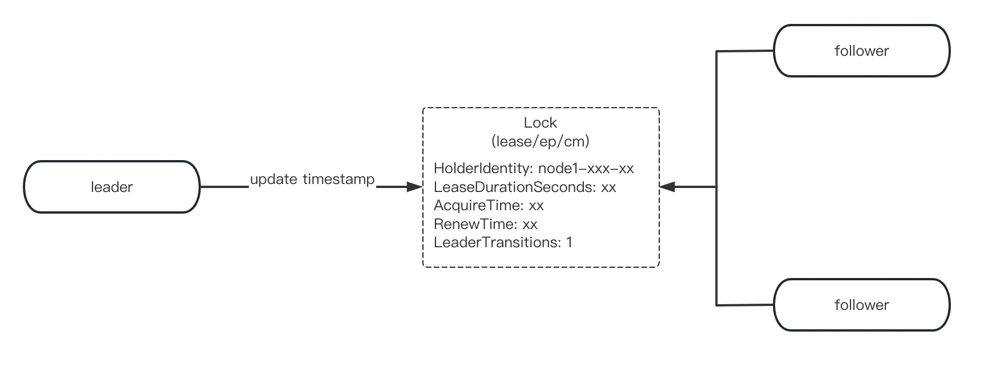

# overview
这篇文档围绕scheduler组建的leader选举为中心，对scheduler其他逻辑并没有太多侧重点。
scheduler这个组件是有leader选举的，并且是不使用etcd来实现leader election.


# background & introduction
近年来，随着对可靠系统和基础设施的需求增加，“高可用性”一词越来越受欢迎。在分布式系统中，高可用性通常涉及最大化正常运行时间和使系统容错。高可用性中常见的做法是使用冗余来最大程度地减少单点故障。为冗余准备您的系统和服务可能就像在负载均衡器后面**部署更多副本**一样简单。尽管这样的配置适用于许多应用程序，但某些用例需要在副本之间进行**协调**才能使系统正常工作。

一个很好的例子是将 Kubernetes scheduler /  controller mgmt 部署为多个实例。为了防止任何意外行为，leader选举过程必须确保在副本中选出一名领导者，并且是唯一主动协调集群的人。其他实例应保持不活动状态，但准备好在leader 发生故障时接管。


# 探索&&问题
之前使用kubespray provision了一个ha cluster, 是2个node 来作为master node, 3个worker node。 
我一直以为两个master node的scheduler 是独立运行，看了一下scheduler pod的日志，大概如下所示
```
[instance.go:274] Using reconciler: lease
[lease.go:235] Resetting endpoints for master service "kubernetes" to 10.xx.xx.xx
```
然后当时公司同事问了一下lease,以及scheduler leader选举的一些问题
使用如下命令去查看了一下endpoint, 居然发现没有endpoint, 但是有leader选举的日志
```
kubectl get ep -n kube-system
```
同事提示了一下要看lease, 发现跟我以前看的逻辑还是有点区别的, `kubectl describe lease kube-scheduler -n kube-system 
`
```yaml
apiVersion: coordination.k8s.io/v1
kind: Lease
metadata:
  creationTimestamp: "2022-11-30T15:37:15Z"
  labels:
    k8s.io/component: kube-scheduler
    kubernetes.io/hostname: kind-control-plane
  name: kube-scheduler
  namespace: kube-system
  resourceVersion: "18171"
  uid: d6c68901-4ec5-4385-b1ef-2d783738da6c
spec:
  Acquire Time: 2022-11-30T18:04:27.912073Z
  holderIdentity: node2-xxx-xxx
  leaseDurationSeconds: 3600
  lease transitions: 1
  renewTime: "2022-11-30T18:14:27.912073Z"
```

那就让我们继续带着问题出发，我们的问题分别是：
1. ha cluster, 另外一个master 的scheduler是在什么情况下怎么获取leader的
2. why use lease instead of endpoint
3. 为什么只有一个master node的时候，也要默认开启leader


# 查看配置
首先我们查看一下scheduler 启动的yaml文件，我们发现两个master node的scheduler都是默认启动了leader选举
```
--leader-elect=true
```
然后我们开始查看我们的kubernetes 源码配置，发现跟leader选举的启动参数有以下几个

```go
type LeaderElectionConfiguration struct {

    // 是否开启选举功能，默认开启
	LeaderElect bool
	// 锁的失效时间，类似于 session-timeout
	LeaseDuration metav1.Duration
	// leader 的心跳间隔，必须小于等于 lease-duration
	RenewDeadline metav1.Duration
	// leader-elect-retry-period: non-leader 
	RetryPeriod metav1.Duration
	// 用什么对象来存放选主信息, 可以用 lease, ep, configmap
	ResourceLock string
	// lease/endpoint 的名称，kube-scheduler
	ResourceName string
	// lease/ep/configmap放哪个namespace
	ResourceNamespace string
}
```

查看了源码，位置： https://github.com/kubernetes/kubernetes/blob/release-1.25/cmd/kube-scheduler/app/options/options.go#L91
可以看出，1.25版本的kubernetes scheduler组件默认是使用lease作为锁
```go
func NewOptions() *Options {
	o := &Options{
	
		LeaderElection: &componentbaseconfig.LeaderElectionConfiguration{
			LeaderElect:       true,
			LeaseDuration:     metav1.Duration{Duration: 15 * time.Second},
			RenewDeadline:     metav1.Duration{Duration: 10 * time.Second},
			RetryPeriod:       metav1.Duration{Duration: 2 * time.Second},
			ResourceLock:      "leases",
			ResourceName:      "kube-scheduler",
			ResourceNamespace: "kube-system",
		},
	}
```
当然代码也提供了覆盖功能，如果在启动参数配置`leader-elect-resource-lock`是可以配置成endpoint的，代码就不展示了，位置在https://github.com/kubernetes/kubernetes/blob/release-1.25/cmd/kube-scheduler/app/options/options.go#L166


# 原理
## 锁结构


```go
type LeaderElectionRecord struct {
	// HolderIdentity is the ID that owns the lease. If empty, no one owns this lease and
	// all callers may acquire. Versions of this library prior to Kubernetes 1.14 will not
	// attempt to acquire leases with empty identities and will wait for the full lease
	// interval to expire before attempting to reacquire. This value is set to empty when
	// a client voluntarily steps down. 他的注释已经足够清晰了，我就不翻译了
	HolderIdentity       string      `json:"holderIdentity"`
	LeaseDurationSeconds int         `json:"leaseDurationSeconds"`
    // Leader 第一次成功获得租约时的时间戳
	AcquireTime          metav1.Time `json:"acquireTime"`
	RenewTime            metav1.Time `json:"renewTime"`
    // leader 更换
	LeaderTransitions    int         `json:"leaderTransitions"`
}
```

## 发起选leader
现在我们有 lease, endpoint, configmap等resourcelock, 这些锁需要实现以下接口, 代码链接 https://github.com/kubernetes/client-go/blob/release-1.25/tools/leaderelection/resourcelock/interface.go
```go
type Interface interface {
	// Get returns the LeaderElectionRecord
	Get(ctx context.Context) (*LeaderElectionRecord, []byte, error)

	// Create attempts to create a LeaderElectionRecord
	Create(ctx context.Context, ler LeaderElectionRecord) error

	// Update will update and existing LeaderElectionRecord
	Update(ctx context.Context, ler LeaderElectionRecord) error

	// RecordEvent is used to record events
	RecordEvent(string)

	// Identity will return the locks Identity
	Identity() string

	// Describe is used to convert details on current resource lock
	// into a string
	Describe() string
}
```

以 `LeaseResourceLock` 的选举过程为例：
```go
func (ll *LeaseLock) Create(ctx context.Context, ler LeaderElectionRecord) error {
	var err error
	ll.lease, err = ll.Client.Leases(ll.LeaseMeta.Namespace).Create(ctx, &coordinationv1.Lease{
		ObjectMeta: metav1.ObjectMeta{
			Name:      ll.LeaseMeta.Name,
			Namespace: ll.LeaseMeta.Namespace,
		},
		Spec: LeaderElectionRecordToLeaseSpec(&ler),
	}, metav1.CreateOptions{})
	return err
}
func LeaderElectionRecordToLeaseSpec(ler *LeaderElectionRecord) coordinationv1.LeaseSpec {
	leaseDurationSeconds := int32(ler.LeaseDurationSeconds)
	leaseTransitions := int32(ler.LeaderTransitions)
	return coordinationv1.LeaseSpec{
		HolderIdentity:       &ler.HolderIdentity,
		LeaseDurationSeconds: &leaseDurationSeconds,
		AcquireTime:          &metav1.MicroTime{ler.AcquireTime.Time},
		RenewTime:            &metav1.MicroTime{ler.RenewTime.Time},
		LeaseTransitions:     &leaseTransitions,
	}
}

// Update will update an existing Lease spec.
func (ll *LeaseLock) Update(ctx context.Context, ler LeaderElectionRecord) error {
	if ll.lease == nil {
		return errors.New("lease not initialized, call get or create first")
	}
	ll.lease.Spec = LeaderElectionRecordToLeaseSpec(&ler)

	lease, err := ll.Client.Leases(ll.LeaseMeta.Namespace).Update(ctx, ll.lease, metav1.UpdateOptions{})
	if err != nil {
		return err
	}

	ll.lease = lease
	return nil
}

```


### scheduler Run 
位置 https://github.com/kubernetes/kubernetes/blob/release-1.25/cmd/kube-scheduler/app/server.go#L146
首先scheduler 在通过启动参数，构建了cc这个对象，如果启动了leader election, 他就开始进入构建 leaderElector对象，并且通过`leaderElector.Run(ctx)` 来开始进入选举， 也就是说**scheduler 在启动时就会发起选主**
此方法负责运行领导者选举循环。它首先尝试获取锁（使用 le.acquire）。成功后，它会运行我们之前配置的 OnStartedLeading 回调并定期更新租约。如果获取锁失败，它只会运行 OnStoppedLeading 回调并返回。

```go
func Run(ctx context.Context, cc *schedulerserverconfig.CompletedConfig, sched *scheduler.Scheduler) error {
	// remove some useless logic here...

	// If leader election is enabled, runCommand via LeaderElector until done and exit.
	if cc.LeaderElection != nil {
		cc.LeaderElection.Callbacks = leaderelection.LeaderCallbacks{
			OnStartedLeading: func(ctx context.Context) {
				close(waitingForLeader)
				sched.Run(ctx)
			},
			OnStoppedLeading: func() {
				select {
				case <-ctx.Done():
					// We were asked to terminate. Exit 0.
					klog.InfoS("Requested to terminate, exiting")
					os.Exit(0)
				default:
					// We lost the lock.
					klog.ErrorS(nil, "Leaderelection lost")
					klog.FlushAndExit(klog.ExitFlushTimeout, 1)
				}
			},
		}
		leaderElector, err := leaderelection.NewLeaderElector(*cc.LeaderElection)
		if err != nil {
			return fmt.Errorf("couldn't create leader elector: %v", err)
		}

		leaderElector.Run(ctx)

		return fmt.Errorf("lost lease")
	}

	// Leader election is disabled, so runCommand inline until done.
	close(waitingForLeader)
	sched.Run(ctx)
	return fmt.Errorf("finished without leader elect")
}

```
现在我们来看看 `leaderElector.Run(ctx)` 发生了什么事情
acquire 和 renew 方法实现中最重要的部分是对 tryAcquireOrRenew 的调用，它包含锁定机制的核心逻辑。

总结一下大概流程如下
* tryAcquireOrRenew 函数尝试获取租约
    * 获取不到 lease,并且 错误是找不到这个名字的lease，那么就尝试 create lease， 开始创建租约
    * 如果获取lease有其他错误，那么返回 false，不再继续下面的逻辑
* 如果创建租约成功，或者获取到租约的情况下，检查租约的 Identity & Time
    * 更新本地缓存的租约，并更新观察时间戳，用来判断租约是否到期
        * leader 的租约尚未到期，自己暂时不能抢占它，函数返回 false
    * 租约到期，而 leader 身份不变，因此获得租约的时间戳 AcquireTime 保持不变
    * 租约到期，leader 易主，transtions+1 说明 leader 更替了
    * 尝试去更新租约记录
        * 更新失败，函数返回 false
        * 更新成功，函数返回 true
* 函数返回 True 说明本 goroutine 已成功抢占到锁，获得租约合同，成为 leader。


```go
// Run starts the leader election loop. Run will not return
// before leader election loop is stopped by ctx or it has
// stopped holding the leader lease
func (le *LeaderElector) Run(ctx context.Context) {
	defer runtime.HandleCrash()
	defer func() {
		le.config.Callbacks.OnStoppedLeading()
	}()

	if !le.acquire(ctx) {
		return // ctx signalled done
	}
	ctx, cancel := context.WithCancel(ctx)
	defer cancel()
	go le.config.Callbacks.OnStartedLeading(ctx)
	le.renew(ctx)
}

// acquire loops calling tryAcquireOrRenew and returns true immediately when tryAcquireOrRenew succeeds.
// Returns false if ctx signals done.
func (le *LeaderElector) acquire(ctx context.Context) bool {
	ctx, cancel := context.WithCancel(ctx)
	defer cancel()
	succeeded := false
	desc := le.config.Lock.Describe()
	klog.Infof("attempting to acquire leader lease %v...", desc)
	wait.JitterUntil(func() {
		succeeded = le.tryAcquireOrRenew(ctx)
		le.maybeReportTransition()
		if !succeeded {
			klog.V(4).Infof("failed to acquire lease %v", desc)
			return
		}
		le.config.Lock.RecordEvent("became leader")
		le.metrics.leaderOn(le.config.Name)
		klog.Infof("successfully acquired lease %v", desc)
		cancel()
	}, le.config.RetryPeriod, JitterFactor, true, ctx.Done())
	return succeeded
}

// tryAcquireOrRenew tries to acquire a leader lease if it is not already acquired,
// else it tries to renew the lease if it has already been acquired. Returns true
// on success else returns false.
func (le *LeaderElector) tryAcquireOrRenew(ctx context.Context) bool {
	now := metav1.Now()
	leaderElectionRecord := rl.LeaderElectionRecord{
		HolderIdentity:       le.config.Lock.Identity(),
		LeaseDurationSeconds: int(le.config.LeaseDuration / time.Second),
		RenewTime:            now,
		AcquireTime:          now,
	}

	// 1. obtain or create the ElectionRecord
    //  这个也就是上面 lease get的方法实现
	oldLeaderElectionRecord, oldLeaderElectionRawRecord, err := le.config.Lock.Get(ctx)
	if err != nil {
        //  如果 是获取不到 lease的其他错误, 那么返回false
		if !errors.IsNotFound(err) {
			klog.Errorf("error retrieving resource lock %v: %v", le.config.Lock.Describe(), err)
			return false
		}
        //  能进入这里，说lease 404，那么就尝试 create lease
		if err = le.config.Lock.Create(ctx, leaderElectionRecord); err != nil {
			klog.Errorf("error initially creating leader election record: %v", err)
			return false
		}

		le.setObservedRecord(&leaderElectionRecord)

		return true
	}
    //  如果创建租约成功，或者获取到租约的情况下
	// 2. Record obtained, check the Identity & Time
    //  更新本地缓存的租约，并更新观察时间戳，用来判断租约是否到期
	if !bytes.Equal(le.observedRawRecord, oldLeaderElectionRawRecord) {
		le.setObservedRecord(oldLeaderElectionRecord)

		le.observedRawRecord = oldLeaderElectionRawRecord
	}

    // leader 的租约尚未到期，自己暂时不能抢占它，函数返回 false
	if len(oldLeaderElectionRecord.HolderIdentity) > 0 &&
		le.observedTime.Add(le.config.LeaseDuration).After(now.Time) &&
		!le.IsLeader() {
		klog.V(4).Infof("lock is held by %v and has not yet expired", oldLeaderElectionRecord.HolderIdentity)
		return false
	}

	// 3. We're going to try to update. The leaderElectionRecord is set to it's default
	// here. Let's correct it before updating.
     // 3. 租约到期，而 leader 身份不变，因此获得租约的时间戳 AcquireTime 保持不变
	if le.IsLeader() {
		leaderElectionRecord.AcquireTime = oldLeaderElectionRecord.AcquireTime
		leaderElectionRecord.LeaderTransitions = oldLeaderElectionRecord.LeaderTransitions
	} else {
        //  // 租约到期，leader 易主，transtions+1 说明 leader 更替了
		leaderElectionRecord.LeaderTransitions = oldLeaderElectionRecord.LeaderTransitions + 1
	}

	// update the lock itself
    //  // 尝试去更新租约记录， 
	if err = le.config.Lock.Update(ctx, leaderElectionRecord); err != nil {
		klog.Errorf("Failed to update lock: %v", err)
		return false
	}
   // 更新成功，函数返回 true
	le.setObservedRecord(&leaderElectionRecord)
	return true
}

```

# 解答我们的问题
Q:  一开始怎么判断谁是leader

A: 不需要判断谁是leader, 每个scheduler 启动都是只要获取不到lease, 那么就创建lease，成为leader

Q: 另外一个master 的scheduler是在什么情况下怎么获取leader的

A: 这是在已经有lease的情况下，并且leader不是自己的情况下的问题， 这个时候会等待并且观察时间戳，等租约到期，就开始更换leader了，更新成功即可


Q: why use lease instead of endpoint

A: 在代码的注释有提到这一块 https://github.com/kubernetes/kubernetes/blob/release-1.26/staging/src/k8s.io/client-go/tools/leaderelection/resourcelock/interface.go#L37
在使用 EndpointsLeasesResourceLock 时，需要保证API Priority & Fairness 配置了非默认的流程模式，这将捕获与领导者选举相关的必要操作
endpoint对象。
cm 和 ep 的实现高负载下表现不保证，所以还是默认使用lease。


Q: 为什么只有一个master node的时候，也要默认开启leader

A: 这是因为，就算不考虑多个Master的情况下，我们本来也要支持类似deployment rolling upgrade的场景。
当我们更新scheduler, 并且部署方式是deployment, upgrade过程中会出现2个 pod的，因此默认会开启leader

# summary
Kubernetes 中的leader 选举过程很简单。它从创建一个锁对象开始，leader定期更新当前时间戳，以此作为通知其他副本其领导地位的一种方式。这个锁对象可以是 Lease 、 ConfigMap 或 Endpoint ，也持有当前领导者的身份。如果领导者未能在给定的时间间隔内更新时间戳，则认为它已经崩溃，这是当不活动的副本通过使用其身份更新锁来竞相获得领导权时。成功获取锁的 pod 将成为新的领导者。

说句题外话：
其实kubernetes leader election 里面使用的lease 锁还是很明显的乐观锁的，他是用kubernetes 操作的原子性来确保没有两个副本可以同时获得租约（否则可能导致竞争条件和其他意外行为！）。每当 Lease 更新（更新或获取）时，其上的 resourceVersion 字段也会由 Kubernetes 更新。当另一个进程尝试同时更新 Lease 时，Kubernetes 会检查更新对象的 resourceVersion 字段是否与当前对象匹配——如果不匹配，则更新失败，从而防止并发问题！
