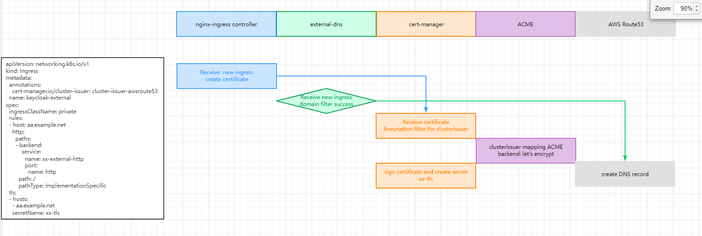

## Overview

这篇文档主要是讲解如何在Kubernetes 集群中签证书。（赶工，还不是因为要交接）

Cert-manager:

Cert-manager是一个在Kubernetes 集群中提供证书的控制器。然后它将这些证书请求发送到`Let'sEncrypt` API服务器进行签名。这将生成一个Kubernetes `Secret`形式的签名证书。

External DNS

`ExternalDNS`运行在集群中，在AWS DNS中创建DNS记录。根据云提供商的不同例如AWS Route53。它可以监视`Ingress `资源以及带注释的LoadBalancer Service和 自动为相应的endpoint 创建DNS记录的入口控制器通过Layer 7路由，所以它是可能的在本地计算机上配置主机名并将其指向入口控制器服务，这是一个繁琐和复杂的的过程。ExternalDNS自动化此过程。

Nginx-ingress

运行在Kubernets集群内部的容器可以通过Pod to Service通信相互通信。Kubernetes中使用一个入口控制器，以一种简单的方式将集群内的服务公开给集群外的客户端。nginx-ingress是我们使用的入口控制器。每个入口控制器需要一个LoadBalancer服务，该服务将给它一个集群外的ip。流量通过负载均衡器流向集群内部的入口控制器实例，然后流量被第7层路由到正确的pod。


(这篇文档是以AWS 平台为主来讲解)


## 组件

| 名字                    | URL                                             | Download link                                            |
| ----------------------- | ----------------------------------------------- | -------------------------------------------------------- |
| Cert-manager            | https://github.com/jetstack/cert-manager        | https://github.com/jetstack/cert-manager/releases/v1.6.0 |
| cert-manager-helm-chart | https://github.com/jetstack/cert-manager        | https://github.com/jetstack/cert-manager/                |
| External-dns            | https://github.com/kubernetes-sigs/external-dns | https://github.com/kubernetes-sigs/external-dns          |
| Nginx-ingress           | https://github.com/nginxinc/kubernetes-ingress  | https://github.com/nginxinc/kubernetes-ingress           |


## 架构图

待补


## 部署


#### EKS 权限

在部署完成EKS 之后，还需要在EKS里面创建以下role并且把role attach到EKS使用的policy中

```
inputs = {
  environment             = local.environment
  cluster_oidc_issuer_url = dependency.eks.outputs.ekscluster_output.identity.0.oidc.0.issuer

  roles = {
    cert-manager = {
      namespace      = "xx-platform"
      description    = "Role and policy for certmanager"
      serviceaccount = "xx-cert-manager"
      policy = [
        {
          "sid" : "allowgetchange"
          "actions" : ["route53:GetChange"],
          "effect" : "Allow",
          "resources" : ["arn:aws:route53:::change/*"]
        },
        {
          "sid" : "allowlisthostedzones"
          "actions" : ["route53:ListHostedZonesByName"],
          "effect" : "Allow",
          "resources" : ["*"]
        },
        {
          "sid" : "allowchangerecordsets"
          "actions" : ["route53:ChangeResourceRecordSets"],
          "effect" : "Allow",
          "resources" : ["arn:aws:route53:::hostedzone/*"]
        }
      ]
    }
    external-dns-private = {
      namespace      = "xx-platform"
      description    = "Role and policy for External DNS Private"
      serviceaccount = "external-dns-private"
      policy = [
        {
          "sid" : "allowgetchange"
          "actions" : ["route53:ChangeResourceRecordSets"],
          "effect" : "Allow",
          "resources" : ["arn:aws:route53:::hostedzone/*"]
        },
        {
          "sid" : "allowlisthostedzones"
          "actions" : ["route53:ListHostedZones",
          "route53:ListResourceRecordSets"],
          "effect" : "Allow",
          "resources" : ["*"]
        }
      ]
    }
    external-dns-central = {
      namespace      = "xx-platform"
      description    = "Role and policy for External DNS Central"
      serviceaccount = "external-dns-central"
      policy = [
        {
          "sid" : "allowgetchange"
          "actions" : ["route53:ChangeResourceRecordSets"],
          "effect" : "Allow",
          "resources" : ["arn:aws:route53:::hostedzone/*"]
        },
        {
          "sid" : "allowlisthostedzones"
          "actions" : ["route53:ListHostedZones",
          "route53:ListResourceRecordSets"],
          "effect" : "Allow",
          "resources" : ["*"]
        }
      ]
    }
    ecr-operator = {
      namespace      = "xx-platform"
      description    = "Role and policy required by ecr operator to create ecr credentials to be used by flux/helm operator"
      serviceaccount = "ecr-operator"
      policy = [
        {
          "sid" : "allowOperatorAccesstoECR",
          "effect" : "Allow",
          "actions" : [
            "ecr:GetAuthorizationToken",
            "ecr:BatchCheckLayerAvailability",
            "ecr:GetDownloadUrlForLayer",
            "ecr:GetRepositoryPolicy",
            "ecr:DescribeRepositories",
            "ecr:ListImages",
            "ecr:DescribeImages",
            "ecr:BatchGetImage",
            "ecr:ListTagsForResource"
          ],
          "resources" : ["arn:aws:ecr:*"]
        }
      ]
    }
  }
}
```


如下所示，上面的terragrunt调取下面的terraform 

```terraform
locals {
  oidc_provider    = replace(var.cluster_oidc_issuer_url, "https://", "")
  arn              = "arn:${data.aws_partition.current.partition}:iam::${data.aws_caller_identity.current.account_id}"
  policy_principal = "${local.arn}:oidc-provider/${local.oidc_provider}"
  annotations      = [for k, v in var.roles : "eks.amazonaws.com/role-arn: ${local.arn}:role/${var.environment}-${k}-${v.namespace}"]
}

data "aws_caller_identity" "current" {}

data "aws_iam_policy_document" "self" {
  for_each = var.roles
  dynamic "statement" {
    for_each = [for p in each.value.policy : {
      sid       = p.sid
      effect    = p.effect
      resources = p.resources
      actions   = p.actions
    }]

    content {
      sid       = statement.value.sid
      effect    = statement.value.effect
      resources = statement.value.resources
      actions   = statement.value.actions
    }
  }
}

data "aws_partition" "current" {}

resource "aws_iam_policy" "self" {
  for_each    = var.roles
  name_prefix = "${var.environment}-${each.key}-${each.value.namespace}"
  description = each.value.description
  policy      = data.aws_iam_policy_document.self[each.key].json
}

resource "aws_iam_role" "self" {
  for_each           = var.roles
  name               = "${var.environment}-${each.key}-${each.value.namespace}"
  assume_role_policy = <<EOF
{
    "Version": "2012-10-17",
    "Statement": [
        {
            "Effect": "Allow",
            "Principal": {
                "Federated": "${local.policy_principal}"
            },
            "Action": "sts:AssumeRoleWithWebIdentity",
            "Condition": {
                "StringEquals": {
                    "${local.oidc_provider}:sub": "system:serviceaccount:${each.value.namespace}:${each.value.serviceaccount}"
                }
            }
        }
    ]
}
    EOF
  tags               = var.resource_tags
}

resource "aws_iam_role_policy_attachment" "self" {
  for_each   = var.roles
  policy_arn = aws_iam_policy.self[each.key].arn
  role       = aws_iam_role.self[each.key].name
}
```


## 组件流程

1. External-dns 在AWS DNS zone创建DNS record
2. Cluster-issuer-route53 在ingress 资源里面告诉cert-manager去创建certificate
3. cert-manager  去Let's encrypt 创建一个签名的request 并且接受ACME的返回
4. cert-manager 在DNS 里面添加ACME token
5. let's Encrypt 验证token 
6. Lets encrypt 返回签名的证书certificate给cert-manager
7. cert-manager 保存cert跟key 在K8S secret里面(这个secret就是ingress tls那里指定的文件名)

## 用户排查流程

用户看到的排查图

