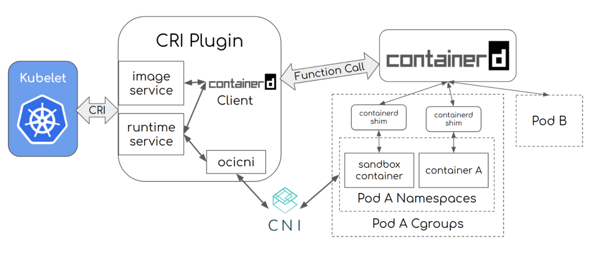

本篇文章是基于commit id: 8e8b6a01cf6bf55dea5e2e4f554597a95c82988a写下的源码分析文档


# Overview

CRI也就是容器运行时接口，在整个Kubernetes中，始终围绕着image和container来运转，拉取image，启动container, 销毁container，删除image，而这一部分是CRI来定义接口的，container和image生命周期彼此隔离。


# 执行流程

1. 用户创建了一个pod
2. 调度器为该pod分配了一个node A
3. node A上的kubelet监听到有pod被分配到该节点，然后进入创建Pod调用CRI Pod接口
4. kubelet开始RunPodSanbox， CNI为sandbox设置网络
5. kubelet开始pullImage以及startContainer
6. kubelet返回状态


# CRI架构




# CRI 接口

Kubelet 作为 CRI 的客户端，而容器运行时则需要实现 CRI 的服务端（即 gRPC server）。容器运行时在启动 gRPC server 时需要监听在本地的 Socket 。

从CRI定义的gRPC接口我们可以看到分为两类接口：ImageService和RuntimeServiec。其中ImageService是负责管理容器的镜像，而RuntimeService则负责对容器生命周期进行管理和跟容器交互（例如我们平时执行的kubectl exec/ kubectl port-forward/ kubectl attach）

代码位置：`./staging/src/k8s.io/cri-api/pkg/apis/runtime`

```protobuf
service RuntimeService {
    // Version returns the runtime name, runtime version, and runtime API version.
    rpc Version(VersionRequest) returns (VersionResponse) {}    
    rpc RunPodSandbox(RunPodSandboxRequest) returns (RunPodSandboxResponse) {}
    ...
}

// ImageService defines the public APIs for managing images.
service ImageService {    
    rpc ListImages(ListImagesRequest) returns (ListImagesResponse) {}
	...
}
```


## Pod接口

代码位置：`./staging/src/k8s.io/cri-api/pkg/apis/runtime/service.go`

`RunPodSandbox`是创建整个Pod的流程方法，当我们创建一个Pod的时候，CRI对这个接口的实现就是创建一个"infra container"的特殊容器，首先会创建一个镜像是`k8s.gcr.io/pause:3.1`的container，然后这个container将容器组里面所有容器联合在一起，为它们提供基础设施。 在infra container创建完成之后，Kubelet会对Pod容器组里面的其他容器进行创建，每创建一个容器就调用`CreateContainer`和`StartContainer`这两个容器接口。

对容器的Namespace的配置一般有两种模式：“None”模式（也就是创建该容器独有的Namespace），另外一种就是"Container"模式（也就是加入另外一个容器的Namespace），因此我们只需要选择"Container"模式让它加入infra container的Namespace即可。

接下来CRI  会调用StartContainer去启动容器。

最后，Kubelet会不断调用ListPodSandbox和ListContainer这两个CRI接口来获取本Node上的容器的状态

```go
type PodSandboxManager interface {	
    // 创建和启动一个pod级别的sandbox
	RunPodSandbox(config *runtimeapi.PodSandboxConfig, runtimeHandler string) (string, erro	
    // 停止一个sandbox
	StopPodSandbox(podSandboxID string) error
     // 删除sandbox  
	RemovePodSandbox(podSandboxID string) error	
     //  返回PodSandbox的状态
	PodSandboxStatus(podSandboxID string) (*runtimeapi.PodSandboxStatus, error)       
	// ListPodSandbox 返回一组sandbox
	ListPodSandbox(filter *runtimeapi.PodSandboxFilter) ([]*runtimeapi.PodSandbox, error)
	// 准备流endpoint和转发podsandbox断开，返回一个地址
	PortForward(*runtimeapi.PortForwardRequest) (*runtimeapi.PortForwardResponse, error)
}
```


### RunPodSandbox 代码解析

代码位置`pkg/kubelet/dockershim/docker_sandbox.go`

整个流程可以总结为

1. 首先拉取"k8s.gcr.io/pause:3.1" docker image
2. 创建sandbox 容器CreateContainer 以及设置容器网络setNetworkReady
3. 创建sandbox的checkpoint CreateCheckpoint
4. 启动sandbox 容器StartContainer
5. 设置pod网络

```go
func (ds *dockerService) RunPodSandbox(ctx context.Context, r *runtimeapi.RunPodSandboxRequest) (*runtimeapi.RunPodSandboxResponse, error) {
	config := r.GetConfig()

	// Step 1: 拉去sandbox image也就是pause image
	image := defaultSandboxImage
	podSandboxImage := ds.podSandboxImage
	if len(podSandboxImage) != 0 {
		image = podSandboxImage
	}

	if err := ensureSandboxImageExists(ds.client, image); err != nil {
		return nil, err
	}

	// Step 2: 创建sandbox容器
	if r.GetRuntimeHandler() != "" && r.GetRuntimeHandler() != runtimeName {
		return nil, fmt.Errorf("RuntimeHandler %q not supported", r.GetRuntimeHandler())
	}
	createConfig, err := ds.makeSandboxDockerConfig(config, image)
	createResp, err := ds.client.CreateContainer(*createConfig)

	
	resp := &runtimeapi.RunPodSandboxResponse{PodSandboxId: createResp.ID}

    // 把sandbox 网络状态设置ready
	ds.setNetworkReady(createResp.ID, false)
	defer func(e *error) {
		// Set networking ready depending on the error return of
		// the parent function
		if *e == nil {
			ds.setNetworkReady(createResp.ID, true)
		}
	}(&err)

	// Step 3: 创建sandbox 的checkpoint
	if err = ds.checkpointManager.CreateCheckpoint(createResp.ID, constructPodSandboxCheckpoint(config)); err != nil {
		return nil, err
	}

	// Step 4: 启动sandbox 容器	
	err = ds.client.StartContainer(createResp.ID)
	if dnsConfig := config.GetDnsConfig(); dnsConfig != nil {
		containerInfo, err := ds.client.InspectContainer(createResp.ID)

		if err := rewriteResolvFile(containerInfo.ResolvConfPath, dnsConfig.Servers, dnsConfig.Searches, dnsConfig.Options); err != nil {
			return nil, fmt.Errorf("rewrite resolv.conf failed for pod %q: %v", config.Metadata.Name, err)
		}
	}
	
	if config.GetLinux().GetSecurityContext().GetNamespaceOptions().GetNetwork() == runtimeapi.NamespaceMode_NODE {
		return resp, nil
	}

	// Step 5: 使用CNI插件为sandbox设置网络
	cID := kubecontainer.BuildContainerID(runtimeName, createResp.ID)
	networkOptions := make(map[string]string)
	if dnsConfig := config.GetDnsConfig(); dnsConfig != nil {
		// Build DNS options.
		dnsOption, err := json.Marshal(dnsConfig)

		networkOptions["dns"] = string(dnsOption)
	}
	err = ds.network.SetUpPod(config.GetMetadata().Namespace, config.GetMetadata().Name, cID, config.Annotations, networkOptions)
	if err != nil {
		errList := []error{fmt.Errorf("failed to set up sandbox container %q network for pod %q: %v", createResp.ID, config.Metadata.Name, err)}

		// Ensure network resources are cleaned up even if the plugin
		// succeeded but an error happened between that success and here.
		err = ds.network.TearDownPod(config.GetMetadata().Namespace, config.GetMetadata().Name, cID)
		if err != nil {
			errList = append(errList, fmt.Errorf("failed to clean up sandbox container %q network for pod %q: %v", createResp.ID, config.Metadata.Name, err))
		}

		err = ds.client.StopContainer(createResp.ID, defaultSandboxGracePeriod)
		if err != nil {
			errList = append(errList, fmt.Errorf("failed to stop sandbox container %q for pod %q: %v", createResp.ID, config.Metadata.Name, err))
		}

		return resp, utilerrors.NewAggregate(errList)
	}

	return resp, nil
}
```

#### 调用网络插件设置网络

代码位置`pkg/kubelet/dockershim/network/plugins.go`

```go
func (pm *PluginManager) SetUpPod(podNamespace, podName string, id kubecontainer.ContainerID, annotations, options map[string]string) error {
	fullPodName := kubecontainer.BuildPodFullName(podName, podNamespace)

	klog.V(3).Infof("Calling network plugin %s to set up pod %q", pm.plugin.Name(), fullPodName)
	if err := pm.plugin.SetUpPod(podNamespace, podName, id, annotations, options); err != nil {
		return fmt.Errorf("networkPlugin %s failed to set up pod %q network: %v", pm.plugin.Name(), fullPodName, err)
	}
	return nil
}
```


## 容器接口

代码位置：`./staging/src/k8s.io/cri-api/pkg/apis/runtime/service.go`

**值得注意的是，对于Streaming API(Exec、 PortForwaard和Attach)， CRI要求容器运行时返回一个streaming server的URL来接受Kubelet重定向API Server发送过来的请求，这个在CRI Streaming接口章节有详细说明**

```go
type ContainerManager interface {
	// 在特定的PodSandbox中创建一个新的容器
	CreateContainer(podSandboxID string, config *runtimeapi.ContainerConfig, sandboxConfig *runtimeapi.PodSandboxConfig) (string, error)
	// 启动容器
	StartContainer(containerID string) error
	...
    // 就是在容器执行命令
	ExecSync(containerID string, cmd []string, timeout time.Duration) (stdout []byte, stderr []byte, err error)	
    // 准备一个流endpoint和在容器执行命令，返回地址
	Exec(*runtimeapi.ExecRequest) (*runtimeapi.ExecResponse, error)	
    // 准备流endpoint然后attach到容器
	Attach(req *runtimeapi.AttachRequest) (*runtimeapi.AttachResponse, error)	
    // 重新打开stdout/stderr日志文件
	ReopenContainerLog(ContainerID string) error
}
```


```go
type ContainerStatsManager interface {	
    // 返回容器状态
	ContainerStats(containerID string) (*runtimeapi.ContainerStats, error)	
    // 列出所有运行中的容器
	ListContainerStats(filter *runtimeapi.ContainerStatsFilter) ([]*runtimeapi.ContainerStats, error)
}
```

### dockershim实现容器接口

对于Container Manager来说，infra container和其他container并不存在任何区别，那么CRI Manager是怎么区别infra container和其他container呢？ 在下面的代码可以看到，在创建容器的时候，会在加一个label，标识这个容器的类型，当CRI在使用ListPodSanbox的时候就根据这个label来进行filter

```go
func (ds *dockerService) CreateContainer(_ context.Context, r *runtimeapi.CreateContainerRequest) (*runtimeapi.CreateContainerResponse, error) {
	podSandboxID := r.PodSandboxId
	config := r.GetConfig()
	sandboxConfig := r.GetSandboxConfig()
     ..

	labels := makeLabels(config.GetLabels(), config.GetAnnotations())
	// Apply a the container type label.
	labels[containerTypeLabelKey] = containerTypeLabelContainer
	// Write the container log path in the labels.
	labels[containerLogPathLabelKey] = filepath.Join(sandboxConfig.LogDirectory, config.LogPath)
	// Write the sandbox ID in the labels.
	labels[sandboxIDLabelKey] = podSandboxID

	apiVersion, err := ds.getDockerAPIVersion()
	...

	image := ""
	if iSpec := config.GetImage(); iSpec != nil {
		image = iSpec.Image
	}
	containerName := makeContainerName(sandboxConfig, config)
    // 根据配置来创建容器
	createConfig := dockertypes.ContainerCreateConfig{
		Name: containerName,
		Config: &dockercontainer.Config{
			// TODO: set User.
			Entrypoint: dockerstrslice.StrSlice(config.Command),
			Cmd:        dockerstrslice.StrSlice(config.Args),
			Env:        generateEnvList(config.GetEnvs()),
			Image:      image,
			WorkingDir: config.WorkingDir,
			Labels:     labels,
			// Interactive containers:
			OpenStdin: config.Stdin,
			StdinOnce: config.StdinOnce,
			Tty:       config.Tty,		
			Healthcheck: &dockercontainer.HealthConfig{
				Test: []string{"NONE"},
			},
		},
		HostConfig: &dockercontainer.HostConfig{
			Binds: generateMountBindings(config.GetMounts()),
			RestartPolicy: dockercontainer.RestartPolicy{
				Name: "no",
			},
		},
	}

	hc := createConfig.HostConfig
    // 更新配置
	err = ds.updateCreateConfig(&createConfig, config, sandboxConfig, podSandboxID, securityOptSeparator, apiVersion)
	
    // 挂载设备
	devices := make([]dockercontainer.DeviceMapping, len(config.Devices))
	for i, device := range config.Devices {
		devices[i] = dockercontainer.DeviceMapping{
			PathOnHost:        device.HostPath,
			PathInContainer:   device.ContainerPath,
			CgroupPermissions: device.Permissions,
		}
	}
	hc.Resources.Devices = devices

	securityOpts, err := ds.getSecurityOpts(config.GetLinux().GetSecurityContext().GetSeccompProfilePath(), securityOptSeparator)
	...

	hc.SecurityOpt = append(hc.SecurityOpt, securityOpts...)

	cleanupInfo, err := ds.applyPlatformSpecificDockerConfig(r, &createConfig)
		...

	createResp, createErr := ds.client.CreateContainer(createConfig)
	if createErr != nil {
		createResp, createErr = recoverFromCreationConflictIfNeeded(ds.client, createConfig, createErr)
	}

	if createResp != nil {
		containerID := createResp.ID

		if cleanupInfo != nil {
			// we don't perform the clean up just yet at that could destroy information
			// needed for the container to start (e.g. Windows credentials stored in
			// registry keys); instead, we'll clean up when the container gets removed
			ds.containerCleanupInfos[containerID] = cleanupInfo
		}
		return &runtimeapi.CreateContainerResponse{ContainerId: containerID}, nil
	}

	// the creation failed, let's clean up right away - we ignore any errors though,
	// this is best effort
	ds.performPlatformSpecificContainerCleanupAndLogErrors(containerName, cleanupInfo)

	return nil, createErr
}

func (ds *dockerService) Attach(_ context.Context, req *runtimeapi.AttachRequest) (*runtimeapi.AttachResponse, error) {
	if ds.streamingServer == nil {
		return nil, streaming.NewErrorStreamingDisabled("attach")
	}
	_, err := checkContainerStatus(ds.client, req.ContainerId)
	if err != nil {
		return nil, err
	}
	return ds.streamingServer.GetAttach(req)
}
```


### CRI Streaming 接口

1. kubectl exec发送连接上API Server
2. 通过API Server的AA之后API Server将exec的请求转发到Kubelet
3. Kubelet以gRPC client连接CRI gRPC Server，然后CRI返回stream server的URL
4. 然后API Server带着token连接Stream server


## 镜像接口

代码位置：`./staging/src/k8s.io/cri-api/pkg/apis/runtime/service.go`

```go
type ImageManagerService interface {	
	ListImages(filter *runtimeapi.ImageFilter) ([]*runtimeapi.Image, error)	
	ImageStatus(image *runtimeapi.ImageSpec) (*runtimeapi.Image, error)	
	PullImage(image *runtimeapi.ImageSpec, auth *runtimeapi.AuthConfig, podSandboxConfig *runtimeapi.PodSandboxConfig) (string, error)
	...
}
```


### dockershim实现镜像接口

我们可以看看Dockershim是如何实现CRI的镜像接口的， 代码位置`pkg/kubelet/dockershim/docker_image.go`

```go
func (ds *dockerService) PullImage(_ context.Context, r *runtimeapi.PullImageRequest) (*runtimeapi.PullImageResponse, error) {
	image := r.GetImage()
	auth := r.GetAuth()
	authConfig := dockertypes.AuthConfig{}

    // 设置docker 认证包括username, password, registry url
	if auth != nil {
		authConfig.Username = auth.Username
		authConfig.Password = auth.Password
		authConfig.ServerAddress = auth.ServerAddress
		authConfig.IdentityToken = auth.IdentityToken
		authConfig.RegistryToken = auth.RegistryToken
	}
    // 尝试拉去image
	err := ds.client.PullImage(image.Image,
		authConfig,
		dockertypes.ImagePullOptions{},
	)

	imageRef, err := getImageRef(ds.client, image.Image)

	return &runtimeapi.PullImageResponse{ImageRef: imageRef}, nil
}

```


# dockershim实现CRI

开发新的容器运行时只需要实现 CRI 的 gRPC Server，包括 RuntimeService 和 ImageService。以下例子就是来自dockershim，它启动的时候实现了CRI的gRPC Server我们可以看看Dockershim是如何实现CRI的容器接口的， 代码位置`pkg/kubelet/dockershim/remote/docker_server.go`

```go
// 实现是启动了一个grpm server， 然后注册RuntimeService和ImageService
func (s *DockerServer) Start() error {
	// Start the internal service.
	if err := s.service.Start(); err != nil {
		klog.Errorf("Unable to start docker service")
		return err
	}	
	l, err := util.CreateListener(s.endpoint)

	// Create the grpc server and register runtime and image services.
	s.server = grpc.NewServer(
		grpc.MaxRecvMsgSize(maxMsgSize),
		grpc.MaxSendMsgSize(maxMsgSize),
	)
	runtimeapi.RegisterRuntimeServiceServer(s.server, s.service)
	runtimeapi.RegisterImageServiceServer(s.server, s.service)
	go func() {
		if err := s.server.Serve(l); err != nil {
			klog.Fatalf("Failed to serve connections: %v", err)
		}
	}()
	return nil
}

```


