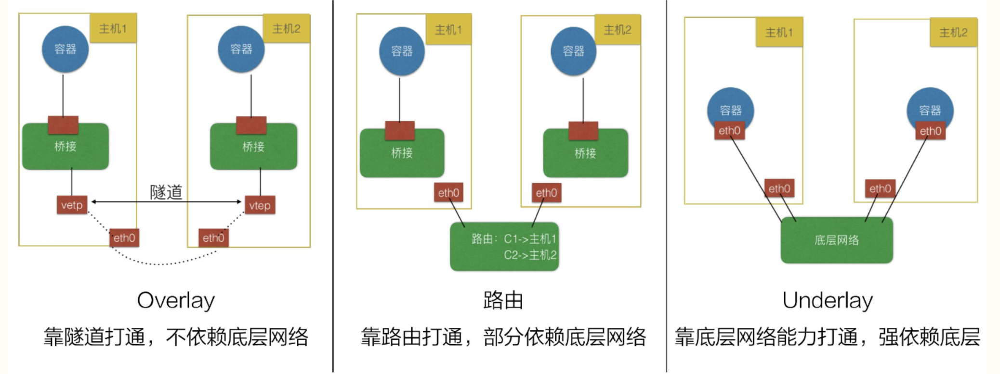

# k8s 网络
* 每个pod 都有一个IP地址
* pod 2 pod之间都能通信
* 允许通过service 来访问后端pod
* ingress能访问svc

cni 要求
支持本地回路cni
支持hostPort
支持流量shaping

https://github.com/containerd/containerd/blob/main/script/setup/install-cni 值得一看


# cni插件分类
* IPAM： IP地址分配
* 主插件：网卡设置
    bridge：创建一个网桥，并把主机端口和容器端口插入网桥
    ipvlan：为容器添加ipvlan网口
    loopback：设置loopback网口
* Meta： 附加功能
    portmap：设置主机端口和容器端口映射
    bandwidth：利用 Linux Traffic Control限流
    firewall：通过 iptables 或 firewalld 为容器设置防火墙规则

总结：
cni插件主要实现两个基本的接口：配置网络和清理网络
ipam插件负责给容器分配IP地址，包括host-local和dhcp

CNI 插件运行机制
容器运行时在启动时会从 CNI 的配置目录中读取 JSON 格式的配置文件。
```bash
cat /etc/cni/net.d # 读取这个 CNI 配置文件
ls -al /opt/cni/bin # CNI 可执行二进制文件
```
文件后缀为 .conf、 .conflist、 .json。如果配置目录中包含多个文件，一般情况下，会以名字排序选用第一个配置文件作为默认的网络配置，并加载获取其中指定的 CNI 插件名称和配置参数。
我们可以看到有个 .conflist 结尾的文件，是的，k8s 的 cni 允许同时使用多个插件，并且会把上一个插件的执行结果作为参数传递给下一个插件，以此我们可以串通多个插件，让多个插件做不同的事情。

Kubernetes Pod 中的其他容器都是Pod所属pause容器的网络，创建过程为：
1. kubelet创建pause 容器生成network namespace
2. 调用网络cni driver
3. cni driver 根据配置调用插件
4. cni插件给pause容器配置网络
5. pod里面的其他容器使用pause容器网络

# cni 插件的通常三种实现模式

* Overlay 模式的典型特征是容器独立于主机的 IP 段，这个 IP 段进行跨主机网络通信时是通过在主机之间创建隧道的方式，将整个容器网段的包全都封装成底层的物理网络中主机之间的包。该方式的好处在于它不依赖于底层网络；
* 路由模式中主机和容器也分属不同的网段，它与 Overlay 模式的主要区别在于它的跨主机通信是通过路由打通，无需在不同主机之间做一个隧道封包。但路由打通就需要部分依赖于底层网络，比如说要求底层网络有二层可达的一个能力；
* Underlay 模式中容器和宿主机位于同一层网络，两者拥有相同的地位。容器之间网络的打通主要依靠于底层网络。因此该模式是强依赖于底层能力的。


# cni 部署
CNI 插件部署的时候一般会启动一个 DaemonSet，然后把 镜像里的二进制文件复制到宿主机的 /opt/cni/bin 目录下，这样就算是完成了部署。
因此写一个 CNI 插件实际就是提供一些包含对应功能的二进制文件给 kubelet 调用。
CNI 可以 设置多个，只不过 CNI 是按照顺序执行~
流程图：

user create pod---> apiserver
                      |
                      | 监听pod创建
                      |
                    kubelet
               |               |
               |               |          
       read config            execute bin------config pod network-----------pod
    /etc/cni/net.d/xxx.conf     /opt/cni/bin/xxxnet


# iptables
网络插件除支持设置和清理 Pod 网络接口外,该插件还需要支持 Iptables。如果 Kube-proxy 工作在 Iptables 模式，网络插件需要确保容器流量能使用 Iptables 转发

# calico
calico除了提供主机和pod之间的网络连接，还涉及网络安全和network policy等
同网段通信，基于第 3 层，Calico 使用 BGP 路由协议在主机之间路由数据包，使用 BGP 路由协议也意味着数据包在主机之间移动时不需要包装在额外的封装层中
跨网段通信，基于 IPinIP 使用虚拟网卡设备 tunl0,用一个 IP 数据包封装另一个 IP 数据包，外层 IP 数据包头的源地址为隧道入口设备的 IP 地址，目标地址为隧道出口设备的 IP 地址。
networpolicy 是Calico 最受欢迎的功能之一，使用 ACLS 协议和 kube-proxy 来创建 iptables 过滤规则，从而实现隔离容器网络的目的。
Calico 有两种模式：
封包解包的隧道模式
动态路由模式
Calico 运行流程：
插件部署后会启动 DaemonSet，该 DaemonSet 会把存放配置文件(/etc/cni/net.d)和二进制文件(/opt/cni/bin)的目录挂载到 Pod 里去，后把镜像里的配置文件和二进制文件复制到对应目录。
DaemonSet 会运行再所有节点上，所以添加或者删除节点时都可以处理。
## Calico 数据流转演示：
同一个节点不同pod：
首先启动一个包含大量工具的容器，比如 centos
```bash
kubectl run --images=centos centos
```
然后进入该 Pod
```bash
$ k exec -it centos-5fdd4bb694-7cgc8 bash
```
查看该 Pod 的 IP 和路由信息
```bash
$ ip a
1: lo: <LOOPBACK,UP,LOWER_UP> mtu 65536 qdisc noqueue state UNKNOWN group default qlen 1000
    link/loopback 00:00:00:00:00:00 brd 00:00:00:00:00:00
    inet 127.0.0.1/8 scope host lo
       valid_lft forever preferred_lft forever
3: eth0@if48: <BROADCAST,MULTICAST,UP,LOWER_UP> mtu 1450 qdisc noqueue state UP group default
    link/ether 16:4c:ec:e4:3a:d6 brd ff:ff:ff:ff:ff:ff link-netnsid 0
    inet 192.168.119.78/32 brd 192.168.119.78 scope global eth0
       valid_lft forever preferred_lft forever

$ ip r
default via 169.254.1.1 dev eth0
169.254.1.1 dev eth0 scope link
```
可以看到有一个默认路由，所有数据都要通过 eth0 发送到 169.254.1.1 这个IP。

然后使用 arpping 看一下 169.254.1.1 这个 IP 是哪个设备
```bash
$ arping 169.254.1.1
ARPING 169.254.1.1 from 192.168.119.78 eth0
Unicast reply from 169.254.1.1 [EE:EE:EE:EE:EE:EE]  0.579ms
Unicast reply from 169.254.1.1 [EE:EE:EE:EE:EE:EE]  0.536ms
```
发现这个 IP 对应的 mac 地址是 EE:EE:EE:EE:EE:EE.

然后退出容器，到主机上看一下有没有 mac 地址全为 e 的设备
```bash
$ ip a
45: calie3f1daf7d15@if3: <BROADCAST,MULTICAST,UP,LOWER_UP> mtu 1450 qdisc noqueue state UP group default
    link/ether ee:ee:ee:ee:ee:ee brd ff:ff:ff:ff:ff:ff link-netnsid 11
    inet6 fe80::ecee:eeff:feee:eeee/64 scope link
       valid_lft forever preferred_lft forever
```
发现还真有，所有以 cali 开头的设备都是这个 mac 地址，这些实际是 calico 创建的 veth pair，一端在 Pod 里，一端在主机上。

然后再看一下宿主机上的路由信息
```bash
[root@agent-1 ~]# ip r
default via 192.168.10.1 dev eth0 
169.254.169.254 via 192.168.10.3 dev eth0 proto static 
blackhole 172.25.0.128/26 proto 80 
172.25.0.131 dev cali1cc9705ed50 scope link 
172.25.0.132 dev cali9d0f51d41f9 scope link 
172.25.0.133 dev cali4dcdb8d77a9 scope link 
172.25.0.134 dev caliac318995356 scope link 
```
发现有好几个 IP 的流量都要转给 cali* 设备，实际上这些流量就是通过 veth pair 又进入到了别的容器里了，这也就是为什么在 Pod 里 ping 别的 Pod 能通。

流量到宿主机转一圈又进入到 Pod 里了。

不同节点上的 Pod
具体节点及 IP 信息如下：
ipamblock:
10-233-90-0-24
node1
cidr: 10.233.90.0/24

ipamblock:
10-233-96-0-24
node: node2
cidr: 10.233.96.0/24
然后 calico 部署后会起一个叫做 bird 的守护进程，该进程的作用就是同步不同节点间的路由信息。
Pod 的网络实际上是一个私有的信息，和组宿主机的网络没有任何关系，其他节点也无法感知当前节点上的 Pod 网段，因此需要借助 bird 这个工具来进行同步。

具体同步的信息就是就是哪个 IP 段和哪个宿主机的 IP 是绑定关系。比如下面的要访问 10.233.96.0/24 这个IP 段就要转发到 192.168.34.11，要访问 10.233.90.0/24 这个 IP 段就需要转发到 192.168.34.10。

因此在 node1 上就会出现这么一条指向 node2 的路由信息
```bash
10.233.96.0/24 via 192.168.34.11 dev tunl0 proto bird onlink
```
同样的 node2 上也有到 node1 的路由信息
```bash
10.233.90.0/24 via 192.168.34.10 dev tunl0 proto bird onlink
```
这样彼此就可以进行通信了。
具体 bird 相关信息可以通过 calico daemonset 中进行查看

# 背景知识：linux namespace
namespace 是 Linux 内核用来隔离内核资源的方式。通过 namespace 可以让一些进程只能看到与自己相关的一部分资源，而另外一些进程也只能看到与它们自己相关的资源，这两拨进程根本就感觉不到对方的存在。具体的实现方式是把一个或多个进程的相关资源指定在同一个 namespace 中。
Linux namespaces 是对全局系统资源的一种封装隔离，使得处于不同 namespace 的进程拥有独立的全局系统资源，改变一个 namespace 中的系统资源只会影响当前 namespace 里的进程，对其他 namespace 中的进程没有影响。


